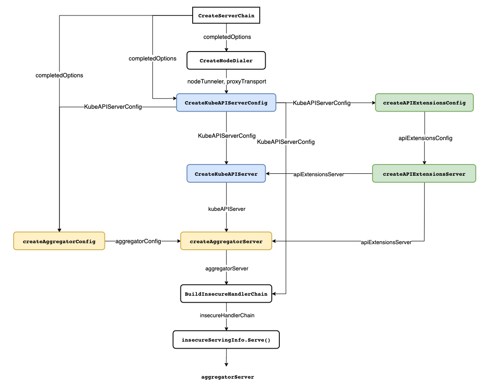
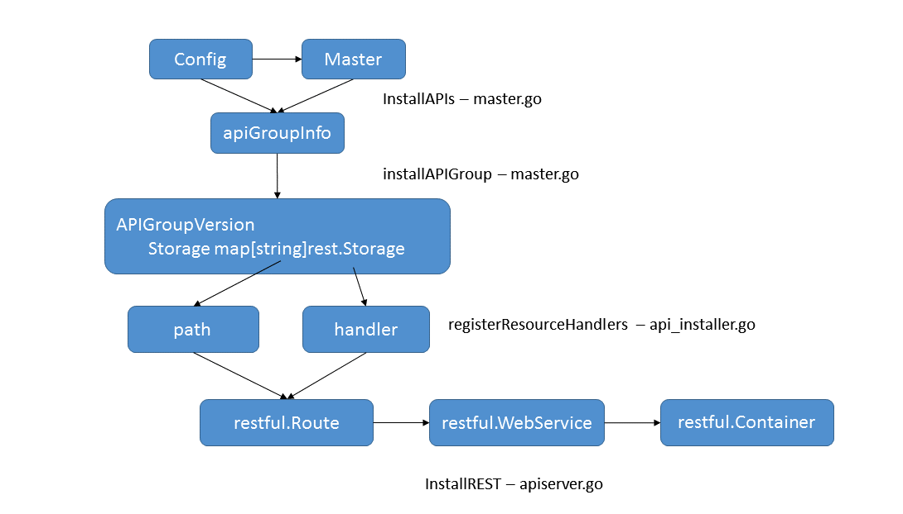

# APIServer


## kube-apiServer

### 相关概述 

kube-ApiServer相当于是k8集群的一个入口，**他其实就是一个负责监听（http/https）指定端口的server，之后处理不同的请求！**


k8s存放在etcd内的存储对象是api.Pod对象（无版本）

请求对象访问的过程：

1. http client访问/api/v1/pod/xyz, 想要获取到这个Pod的数据
2. 从etcd获取到api.Pod对象
3. api.Pod对象转换为v1.Pod对象
4. v1.Pod对象序列化为json或yaml文本
5. 文本通过http的response体，返回给http client

其中有一个重要的数据结构APIGroupVersion：

~~~go
type APIGroupVersion struct {
  //最重要的数据结构，该map的key是用于对，value是rest.Storage结构，用于对接etcd存储，
	Storage map[string]rest.Storage
	Root string
  // 包含api/v1这样的string，用于标示这个实例
	GroupVersion schema.GroupVersion
	OptionsExternalVersion *schema.GroupVersion
	MetaGroupVersion *schema.GroupVersion
	RootScopedKinds sets.String
  // 序列化和反序列化器，决定怎么从api对象转化成字节进行传输
	Serializer     runtime.NegotiatedSerializer 
	ParameterCodec runtime.ParameterCodec

	Typer           runtime.ObjectTyper
	Creater         runtime.ObjectCreater
	Convertor       runtime.ObjectConvertor
	Defaulter       runtime.ObjectDefaulter
	Linker          runtime.SelfLinker
	UnsafeConvertor runtime.ObjectConvertor

	EquivalentResourceRegistry runtime.EquivalentResourceRegistry
	Authorizer authorizer.Authorizer
	Admit admission.Interface
	MinRequestTimeout time.Duration
	OpenAPIModels openapiproto.Models
	MaxRequestBodyBytes int64
}
~~~


总体流程：

kube-apiserver 共由 3 个组件构成（Aggregator. KubeAPIServer. APIExtensionServer），这些组件依次通过 Delegation 处理请求：

- **Aggregator**：暴露的功能类似于一个七层负载均衡，将来自用户的请求拦截转发给其他服务器，并且负责整个 APIServer 的 Discovery 功能；也负责处理ApiService，注册对应的扩展api。
- **KubeAPIServer** ：负责对请求的一些通用处理，认证. 鉴权等，以及处理各个内建资源的 REST 服务；
- **APIExtensionServer**：主要处理 CustomResourceDefinition（CRD）和 CustomResource（CR）的 REST 请求，也是 Delegation 的最后一环，如果对应 CR 不能被处理的话则会返回 404。


### 启动

入口在apiServer.go的`command := app.NewAPIServerCommand()`

其中`command.Execute()`会最终调用cmd的`RunE()`字段，先看`NewAPIServerCommand()`

~~~go
// NewAPIServerCommand creates a *cobra.Command object with default parameters
func NewAPIServerCommand() *cobra.Command {
  // 1.生成一些server的配置，信息包括GenericServerRunOptions，Etcd，KubeletConfig等
	s := options.NewServerRunOptions()
	cmd := &cobra.Command{
		...
		RunE: func(cmd *cobra.Command, args []string) error {
			...
			// set default options
      // 2.完成参数配置，填补一些空白为默认值
			completedOptions, err := Complete(s)

			// 3.validate options 验证一下配置是否合法
			if errs := completedOptions.Validate(); len(errs) != 0 {
				return utilerrors.NewAggregate(errs)
			}

      // 调用本包的Run()函数
      // genericapiserver.SetupSignalHandler()返回一个stopChan()
			return Run(completedOptions, genericapiserver.SetupSignalHandler())
		},
    ...
	}

	...
	return cmd
}
~~~

然后看本包Run()函数：

1. 调用`CreateServerChain`构建服务调用链，并判断是否启动非安全的`httpserver`，`httpserver`链中包含 apiserver要启动的三个server，以及为每个server注册对应资源的路由；
2. 调用`server.PrepareRun`进行服务运行前的准备，该方法主要完成了健康检查，存活检查和OpenAPI路由的注册工作；
3. 调用`prepared.Run`启动server；

~~~go
// Run runs the specified APIServer.  This should never exit.
func Run(completeOptions completedServerRunOptions, stopCh <-chan struct{}) error {
  ...
  // 创建了一个server
	server, err := CreateServerChain(completeOptions, stopCh)
	...
  // 注册handler，执行hook等，返回一个preparedGenericAPIServer
	prepared, err := server.PrepareRun()
	...
	return prepared.Run(stopCh)
}
~~~

因为apiserver本质上就是一个server服务器，所有代码核心就是如何配置server，包括路由、访问权限以及同数据库（etcd）的交互等。

### server创建[ CreateServerChain() ]

看一下`CreateServerChain()`的完整实现：CreateServerChain创建通过委托连接（delegation）的apiservers，创建一系列的server，包括kubeAPIServer、APIExtensionsServer、AggregatorServer，这三者都在底层依赖于GenericAPIServer，通过GenericAPIServer可以将k8s资源与REST API进行映射。

kubeAPIServer是kubernetes独有的API Server，它负责的是kubernetes最主要的api，官方文档里面不建议在这个里面添加和修改api，如果我们有自己编写的api可以放在apiExtensionsServer里面，这个server是负责一些扩展的api。

~~~go
// CreateServerChain creates the apiservers connected via delegation.
func CreateServerChain(completedOptions completedServerRunOptions, stopCh <-chan struct{}) (*aggregatorapiserver.APIAggregator, error) {
  // 创建到节点拨号连接
	nodeTunneler, proxyTransport, err := CreateNodeDialer(completedOptions)

  // 1.创建kubeAPIServerConfig通用配置
	kubeAPIServerConfig, insecureServingInfo, serviceResolver, pluginInitializer, err := CreateKubeAPIServerConfig(completedOptions, nodeTunneler, proxyTransport)
	
  
  // 2.判断是否配置了扩展API server，创建apiExtensionsConfig配置
	apiExtensionsConfig, err := createAPIExtensionsConfig(*kubeAPIServerConfig.GenericConfig, kubeAPIServerConfig.ExtraConfig.VersionedInformers, pluginInitializer, completedOptions.ServerRunOptions, completedOptions.MasterCount,
		serviceResolver, webhook.NewDefaultAuthenticationInfoResolverWrapper(proxyTransport, kubeAPIServerConfig.GenericConfig.EgressSelector, kubeAPIServerConfig.GenericConfig.LoopbackClientConfig))
	
  // 3.启动扩展的apiExtensionsserver
	apiExtensionsServer, err := createAPIExtensionsServer(apiExtensionsConfig, genericapiserver.NewEmptyDelegate())
	
  
  // 4.启动最核心的kubeAPIServer
	kubeAPIServer, err := CreateKubeAPIServer(kubeAPIServerConfig, apiExtensionsServer.GenericAPIServer)

  
	// 5.聚合层的配置aggregatorConfig
	aggregatorConfig, err := createAggregatorConfig(*kubeAPIServerConfig.GenericConfig, completedOptions.ServerRunOptions, kubeAPIServerConfig.ExtraConfig.VersionedInformers, serviceResolver, proxyTransport, pluginInitializer)
	
  // 6.aggregatorServer,聚合服务器，对所有的服务器访问的整合
	aggregatorServer, err := createAggregatorServer(aggregatorConfig, kubeAPIServer.GenericAPIServer, apiExtensionsServer.Informers)
	
  
  // 7.启动非安全端口的server
	if insecureServingInfo != nil {
		insecureHandlerChain := kubeserver.BuildInsecureHandlerChain(aggregatorServer.GenericAPIServer.UnprotectedHandler(), kubeAPIServerConfig.GenericConfig)
    // 启动http服务
		if err := insecureServingInfo.Serve(insecureHandlerChain, kubeAPIServerConfig.GenericConfig.RequestTimeout, stopCh); err != nil {
			return nil, err
		}
	}

  // 8.返回aggregatorServer，后续启动安全端口的server
	return aggregatorServer, nil
}
~~~

创建过程主要有以下步骤：

1. 根据配置构造apiserver的配置，调用方法`CreateKubeAPIServerConfig`

   这里应该是kube-apiserver不同模块实例化所需的通用配置，包括genericConfig实例化、StorageFactory存储配置、OpenAPI/Swagger配置等。

2. 根据配置构造扩展的apiserver的配置，调用方法为`createAPIExtensionsConfig`

3. 创建扩展的apiserver即APIExtensionsServer，调用方法为 `createAPIExtensionsServer`

   具体流程与KubeAPIServer的创建一致。

4. 创建KubeAPIServer，调用方法为`CreateKubeAPIServer`

   主要就是将各个handler的路由方法注册到Container中去，完全遵循go-restful的设计模式，即将处理方法注册到Route中去，同一个根路径下的Route注册到WebService中去，WebService注册到Container中，Container负责分发。访问的过程为Container-->WebService-->Route。

5. 聚合server的配置和和创建

   主要就是将原生的apiserver和扩展的apiserver的访问进行整合，添加后续的一些处理接口。调用方法为`createAggregatorConfig`和`createAggregatorServer`；

6. 启动非安全端口server，即启动http服务

7. aggregatorServer创建完成并返回，后续启动安全端口server，即启动https服务




以上几个步骤，最核心的是apiserver如何创建，即如何按照`go-restful`的模式，添加路由和相应处理方法，以`CreateKubeAPIServer`方法为例，`createAPIExtensionsServer`类似。

#### CreateKubeAPIServer()

KubeAPIServer 主要是提供对 API Resource 的操作请求，**为 kubernetes 中众多 API 注册路由信息，暴露 RESTful API 并且对外提供 kubernetes service**，使集群中以及集群外的服务都可以通过 RESTful API 操作 kubernetes 中的资源。

`CreateKubeAPIServer()`及其深层调用的各种逻辑可以描述为：

将<资源组>/<资源版本>/<资源>与资源存储对象进行映射并将其存储至APIGroupInfo对象的VersionedResourceStorageMap字段中。通过installer.Install安装器为资源注册对应的Handlers方法，完成资源和资源Handlers方法的绑定并为go-restful WebService添加路由。最后将WebService添加到go-restful Container中。

先看`CreateKubeAPIServer()`函数本身：

~~~go
// CreateKubeAPIServer creates and wires a workable kube-apiserver
// 相当于根据kubeAPIServerConfig在扩展apiserver的基础上生成kubeAPIServer
func CreateKubeAPIServer(kubeAPIServerConfig *controlplane.Config, delegateAPIServer genericapiserver.DelegationTarget) (*controlplane.Instance, error) {
  // 通过Complete方法完成配置的最终合法化,完成配置
  // New方法生成kubeAPIServer的配置
  // 这个deletgateAPIServer来自apiExtensionsServer.GenericAPIServer
	kubeAPIServer, err := kubeAPIServerConfig.Complete().New(delegateAPIServer) 
	if err != nil {
		return nil, err
	}

	return kubeAPIServer, nil
}
~~~

其中New()函数通过给定的配置，返回一个新的Instance接口。对于部分未配置的选项，可以使用默认配置；但是对于KubeletClientConfig这样的配置，必须手动指定。

现在看New()函数的具体实现，New()函数主要完成的事情有：

- 创建GenericAPIServer
- 实例化Instance
- InstallLegacyAPI注册/api资源
- InstallAPIs注册/apis资源

在当前的k8s中，支持两类资源组，分别是拥有组名的资源组和没有组名的资源组，k8s通过InstallLegacyAPI()将没有组名的资源组注册到/api前缀的路径下，其表现形式为/api/< version >/< resource >；通过InstallAPIs()将有组名的资源组注册到/apis前缀的路径下，其表现形式为/apis/< group >/< version >/< resource >；

~~~go
func (c completedConfig) New(delegationTarget genericapiserver.DelegationTarget) (*Instance, error) {
	...
	// 1.New()创建GenericAPIServer
  // KubeAPIServer的运行依赖于GenericAPIServer，通过 c.GenericConfig.New() 函数创建名为kube-apiserver的服务
	s, err := c.GenericConfig.New("kube-apiserver", delegationTarget)
	
	if c.ExtraConfig.EnableLogsSupport {
		routes.Logs{}.Install(s.Handler.GoRestfulContainer)
	}

	...
	// 2.实例化Instance
  // KubeAPIServer通过Master/Instance对象进行管理，实例化该对象之后才能注册KubeAPIServer下的资源
	m := &Instance{
		GenericAPIServer:          s,
		ClusterAuthenticationInfo: c.ExtraConfig.ClusterAuthenticationInfo,
	}
  

	// install legacy rest storage
  // 3.将/api开头的版本api注册到Container中去，如Pod、Namespace等资源
  // 先判断Core Groups/v1是否已启用，如果已经启用则注册，目的是可以用过http://ip:端口/api/v1访问到Group/v1下的资源
	if c.ExtraConfig.APIResourceConfigSource.VersionEnabled(apiv1.SchemeGroupVersion) {
		legacyRESTStorageProvider := corerest.LegacyRESTStorageProvider{
			StorageFactory:              c.ExtraConfig.StorageFactory,
			ProxyTransport:              c.ExtraConfig.ProxyTransport,
			KubeletClientConfig:         c.ExtraConfig.KubeletClientConfig,
			EventTTL:                    c.ExtraConfig.EventTTL,
			ServiceIPRange:              c.ExtraConfig.ServiceIPRange,
			SecondaryServiceIPRange:     c.ExtraConfig.SecondaryServiceIPRange,
			ServiceNodePortRange:        c.ExtraConfig.ServiceNodePortRange,
			LoopbackClientConfig:        c.GenericConfig.LoopbackClientConfig,
			ServiceAccountIssuer:        c.ExtraConfig.ServiceAccountIssuer,
			ExtendExpiration:            c.ExtraConfig.ExtendExpiration,
			ServiceAccountMaxExpiration: c.ExtraConfig.ServiceAccountMaxExpiration,
			APIAudiences:                c.GenericConfig.Authentication.APIAudiences,
		}
    // [添加/api路由]
		if err := m.InstallLegacyAPI(&c, c.GenericConfig.RESTOptionsGetter, legacyRESTStorageProvider); err != nil {
			return nil, err
		}
	}

  
	// 4.将/apis开头版本的api注册到Container中
	restStorageProviders := []RESTStorageProvider{
		apiserverinternalrest.StorageProvider{},
		authenticationrest.RESTStorageProvider{Authenticator: c.GenericConfig.Authentication.Authenticator, APIAudiences: c.GenericConfig.Authentication.APIAudiences},
		authorizationrest.RESTStorageProvider{Authorizer: c.GenericConfig.Authorization.Authorizer, RuleResolver: c.GenericConfig.RuleResolver},
		autoscalingrest.RESTStorageProvider{},
		batchrest.RESTStorageProvider{},
		certificatesrest.RESTStorageProvider{},
		coordinationrest.RESTStorageProvider{},
		discoveryrest.StorageProvider{},
		extensionsrest.RESTStorageProvider{},
		networkingrest.RESTStorageProvider{},
		noderest.RESTStorageProvider{},
		policyrest.RESTStorageProvider{},
		rbacrest.RESTStorageProvider{Authorizer: c.GenericConfig.Authorization.Authorizer},
		schedulingrest.RESTStorageProvider{},
		storagerest.RESTStorageProvider{},
		flowcontrolrest.RESTStorageProvider{},
		
		appsrest.StorageProvider{},
		admissionregistrationrest.RESTStorageProvider{},
		eventsrest.RESTStorageProvider{TTL: c.ExtraConfig.EventTTL},
	}
  
  // [添加新版/apis路由]
	if err := m.InstallAPIs(c.ExtraConfig.APIResourceConfigSource, c.GenericConfig.RESTOptionsGetter, restStorageProviders...); err != nil {
		return nil, err
	}

	...

	return m, nil
}
~~~

其中主要添加路由操作由`InstallLegacyAPI()`（针对基础资源，/api开头）和`installAPIs()`（针对附加资源，/apis开头）函数完成，`InstallAPIs`与`InstallLegacyAPI`主要的区别是获取RESTStorage的方式。

对于api开头的路由来说，都是/api/v1这种统一的格式；而对于apis开头路由则不一样，它包含了多种不同的格式（Kubernetes代码内叫groupName），如/apis/apps、/apis/certificates.k8s.io等各种无规律groupName。为此kubernetes提供一种`RESTStorageProvider`的工厂模式的统一接口。


##### InstallLegacyAPI()

这里先看`InstallLegacyAPI()`，整体流程是这样的：



~~~go
// InstallLegacyAPI will install the legacy APIs for the restStorageProviders if they are enabled.
func (m *Instance) InstallLegacyAPI(c *completedConfig, restOptionsGetter generic.RESTOptionsGetter, legacyRESTStorageProvider corerest.LegacyRESTStorageProvider) error {
	// ① 通过NewLegacyRESTStorage方法创建各个资源的RESTStorage
  // 并实例化 apiGroupInfo，apiGroupInfo 对象用于描述资源组信息
  // 该对象有一个字段 VersionedResourcesStorageMap 用于存储资源与资源存储对象的映射关系，
  // 比如：Pod资源<=>/v1/pods/PodStorage
	legacyRESTStorage, apiGroupInfo, err := legacyRESTStorageProvider.NewLegacyRESTStorage(restOptionsGetter)
	
	controllerName := "bootstrap-controller"
	coreClient := corev1client.NewForConfigOrDie(c.GenericConfig.LoopbackClientConfig)
	bootstrapController := c.NewBootstrapController(legacyRESTStorage, coreClient, coreClient, coreClient, coreClient.RESTClient())
	m.GenericAPIServer.AddPostStartHookOrDie(controllerName, bootstrapController.PostStartHook)
	m.GenericAPIServer.AddPreShutdownHookOrDie(controllerName, bootstrapController.PreShutdownHook)

  // ② 通过InstallLegacyAPIGroup()完成路由安装
	if err := m.GenericAPIServer.InstallLegacyAPIGroup(genericapiserver.DefaultLegacyAPIPrefix, &apiGroupInfo); err != nil {
		return fmt.Errorf("error in registering group versions: %v", err)
	}
	return nil
}
~~~

###### NewLegacyRESTStorage()

`NewLegacyRESTStorage()`函数中主要完成**各个核心资源的RESTStorage的创建**，代码太长了不贴了：

（rest.Storage结构是用于对接etcd存储的，每个Storage都有操作ETCD的增删改查方法，比如PodStorage，NodeStorage就是操作对应pod和node在ETCD里面数据的结构，利用它们来实现对ETCD里面数据的操作）

主要处理逻辑有：

- 创建 apiGroupInfo 来描述资源组信息（内含VersionedResourcesStorageMap字段）

- 常见的像event、secret、namespace、endpoints等，统一调用NewREST方法/NewStorage方法构造相应的资源存储对象。一个资源存储对象负责一个资源的增删改查操作，当操作资源数据时候，通过对应的资源存储对象去和Store进行交互，比如：

  ~~~go
  podTemplateStorage, err := podtemplatestore.NewREST(restOptionsGetter)
  ~~~

- 待所有资源的store创建完成之后，使用restStorageMap的Map类型将每个资源的api路径（非完整路径）和对应的storage对应起来，方便后续去做路由的统一规划

  ~~~go
  restStorageMap := map[string]rest.Storage{
  		"pods":             podStorage.Pod,
  		"pods/attach":      podStorage.Attach,
  		"pods/status":      podStorage.Status,
    	...
    	"services":        serviceRest,
  		"services/proxy":  serviceRestProxy,
  		"services/status": serviceStatusStorage,
    	...
  }
  ~~~

最终完成以api开头的所有资源的RESTStorage操作

###### InstallLegacyAPIGroup()

`InstallLegacyAPIGroup()`函数主要完成**路由的安装，即将APIGroupInfo对象中的<资源组>/<版本>/<资源>/<子资源>注册到KubeAPIServer Handlers 方法**

主要流程是：遍历APIGroupInfo，将<资源组>/<版本>/<资源名称>映射到http path请求路径，通过InstallREST函数将资源存储对象作为资源的Handlers方法。最后使用go-restful的ws.Route将定义好的请求路径和Handlers方法添加路由到go-restful中（此处回忆http server内容）

主要调用链为`InstallLegacyAPIGroup-->installAPIResources-->InstallREST-->Install-->registerResourceHandlers`，最终核心的路由构造在`registerResourceHandlers`方法内。所以继续深入吧....

1. InstallLegacyAPIGroup()

~~~go
func (s *GenericAPIServer) InstallLegacyAPIGroup(apiPrefix string, apiGroupInfo *APIGroupInfo) error {
	...
	openAPIModels, err := s.getOpenAPIModels(apiPrefix, apiGroupInfo)
	...
  // *
	if err := s.installAPIResources(apiPrefix, apiGroupInfo, openAPIModels); err != nil {
		return err
	}
	...
	s.Handler.GoRestfulContainer.Add(discovery.NewLegacyRootAPIHandler(s.discoveryAddresses, s.Serializer, apiPrefix).WebService())

	return nil
}
~~~

2. installAPIResources()

`installAPIResources()`方法去注册所有前面拿到的storage

~~~go
// installAPIResources is a private method for installing the REST storage backing each api groupversionresource
func (s *GenericAPIServer) installAPIResources(apiPrefix string, apiGroupInfo *APIGroupInfo, openAPIModels openapiproto.Models) error {
	for _, groupVersion := range apiGroupInfo.PrioritizedVersions {
		...
		apiGroupVersion := s.getAPIGroupVersion(apiGroupInfo, groupVersion, apiPrefix)
		if apiGroupInfo.OptionsExternalVersion != nil {
			apiGroupVersion.OptionsExternalVersion = apiGroupInfo.OptionsExternalVersion
		}
		apiGroupVersion.OpenAPIModels = openAPIModels
		apiGroupVersion.MaxRequestBodyBytes = s.maxRequestBodyBytes
		// *
    // apiGroupVersion里包含了所有前面注册的storage
		if err := apiGroupVersion.InstallREST(s.Handler.GoRestfulContainer); err != nil {
			return fmt.Errorf("unable to setup API %v: %v", apiGroupInfo, err)
		}
	}

	return nil
}
~~~

3. InstallREST()

InstallREST方法注册所有的REST处理器handler（包括storage, watch, proxy和redirect）到restful Container

restful.Container代表一个http rest服务对象，包括一组restful.WebService（每个webserver处理一个对应路径下的所有请求。比如/api/v1/），restful.WebService由多个restful.Route组成，Route是请求的方法、url，在实际实现的时候就是paths数组，同后端的restful.RouteFunction的绑定，Restful请求最终转换成对后端数据库rest.Storage的访问操作。

~~~go
func (g *APIGroupVersion) InstallREST(container *restful.Container) error {
  // 生成url的前缀字符串，如/api/v1/
	prefix := path.Join(g.Root, g.GroupVersion.Group, g.GroupVersion.Version)
	installer := &APIInstaller{
		group:             g,
		prefix:            prefix,
		minRequestTimeout: g.MinRequestTimeout,
	}
	// * 完成资源和资源Handlers方法的绑定
	apiResources, ws, registrationErrors := installer.Install()
	versionDiscoveryHandler := discovery.NewAPIVersionHandler(g.Serializer, g.GroupVersion, staticLister{apiResources})
  // 为go-restful WebService添加路由
	versionDiscoveryHandler.AddToWebService(ws)
  // 将WebService添加到go-restful Container中
	container.Add(ws)
	return utilerrors.NewAggregate(registrationErrors)
}
~~~

4. Install()

~~~go
// Install handlers for API resources.
func (a *APIInstaller) Install() ([]metav1.APIResource, *restful.WebService, []error) {
	var apiResources []metav1.APIResource
	var errors []error
  // 生成新的webService对象
	ws := a.newWebService()

  // 将storage里的所有api路径放入paths数组，然后排序
	paths := make([]string, len(a.group.Storage))
	var i int = 0
	for path := range a.group.Storage {
		paths[i] = path
		i++
	}
	sort.Strings(paths)
 
  // 循环遍历path数组，注册每个path对应的handler，注册好之后放到前面新建的webService里
	for _, path := range paths {
    // * 完成资源和资源Handlers方法的绑定
		apiResource, err := a.registerResourceHandlers(path, a.group.Storage[path], ws)
		
		if apiResource != nil {
			apiResources = append(apiResources, *apiResource)
		}
	}
	return apiResources, ws, errors
}
~~~

5. registerResourceHandlers()

这是一个非常复杂的方法（/vendor/k8s.io/apiserver/pkg/endpoint/install.go），整个方法的代码在700行左右。方法的主要功能是通过上一步骤构造的RESTStorage判断该资源可以执行哪些操作（如create、update、connecte、patch等），将其对应支持的操作存入到actions，每一个action对应一个标准的rest操作(GET, PUT, POST, DELETE, PATCH, CONNECT....)，如create对应的action操作为POST、update对应的action操作为PUT。最终根据actions数组依次遍历，对每一个action创建一个handler方法，注册到route中去，route注册到webservice中去，完美匹配go-restful的设计模式。

太长了啊......

```go
func (a *APIInstaller) registerResourceHandlers(path string, storage rest.Storage, ws *restful.WebService) (*metav1.APIResource, error) {
   ...
  
   // what verbs are supported by the storage, used to know what verbs we support per path
   // 1.调用storage的动作方法，进一步可以判断是否支持这些方法
   // 若此storage支持get方法则得到Getter结构，其他例如create，update，delete这些动作若支持也会得到相应结构体
   // 不同的方法对应着etcd的不同操作
   creater, isCreater := storage.(rest.Creater)
   namedCreater, isNamedCreater := storage.(rest.NamedCreater)
   lister, isLister := storage.(rest.Lister)
   getter, isGetter := storage.(rest.Getter)
   getterWithOptions, isGetterWithOptions := storage.(rest.GetterWithOptions)
   gracefulDeleter, isGracefulDeleter := storage.(rest.GracefulDeleter)
   collectionDeleter, isCollectionDeleter := storage.(rest.CollectionDeleter)
   updater, isUpdater := storage.(rest.Updater)
   patcher, isPatcher := storage.(rest.Patcher)
   watcher, isWatcher := storage.(rest.Watcher)
   connecter, isConnecter := storage.(rest.Connecter)
   storageMeta, isMetadata := storage.(rest.StorageMetadata)
   storageVersionProvider, isStorageVersionProvider := storage.(rest.StorageVersionProvider)
   ...
  
   // 新建actions数组，往此数组里面添加所有的action
   // 这些action是GET,PUT,DELETE,CONNECT等这些REST请求对应的actionn
   actions := []action{}
   
  /* action的结构
  type action struct {
    Verb          string //动作
    Path          string // 路径
    Params        []*restful.Parameter
    Namer         handlers.ScopeNamer
    AllNamespaces bool
	}
	*/
   ...

   // Get the list of actions for the given scope.
   switch {
   case !namespaceScoped:
      ....
   default:
      namespaceParamName := "namespaces"
      // Handler for standard REST verbs (GET, PUT, POST and DELETE).
      namespaceParam := ws.PathParameter("namespace", "object name and auth scope, such as for teams and projects").DataType("string")
      namespacedPath := namespaceParamName + "/{namespace}/" + resource
      namespaceParams := []*restful.Parameter{namespaceParam}

      resourcePath := namespacedPath
      resourceParams := namespaceParams
      itemPath := namespacedPath + "/{name}"
      nameParams := append(namespaceParams, nameParam)
      proxyParams := append(nameParams, pathParam)
      itemPathSuffix := ""
      if isSubresource {
         itemPathSuffix = "/" + subresource
         itemPath = itemPath + itemPathSuffix
         resourcePath = itemPath
         resourceParams = nameParams
      }
      apiResource.Name = path
      apiResource.Namespaced = true
      apiResource.Kind = resourceKind
      namer := handlers.ContextBasedNaming{
         SelfLinker:         a.group.Linker,
         ClusterScoped:      false,
         SelfLinkPathPrefix: gpath.Join(a.prefix, namespaceParamName) + "/",
         SelfLinkPathSuffix: itemPathSuffix,
      }

     	// 然后新建一个action数组并往此数组里面添加所有的action，这些action即GET,PUT和DELETE这些REST请求对应的actionn
      actions = appendIf(actions, action{"LIST", resourcePath, resourceParams, namer, false}, isLister)
      actions = appendIf(actions, action{"POST", resourcePath, resourceParams, namer, false}, isCreater)
      actions = appendIf(actions, action{"DELETECOLLECTION", resourcePath, resourceParams, namer, false}, isCollectionDeleter)
      // DEPRECATED in 1.11
      actions = appendIf(actions, action{"WATCHLIST", "watch/" + resourcePath, resourceParams, namer, false}, allowWatchList)

      actions = appendIf(actions, action{"GET", itemPath, nameParams, namer, false}, isGetter)
      if getSubpath {
         actions = appendIf(actions, action{"GET", itemPath + "/{path:*}", proxyParams, namer, false}, isGetter)
      }
      actions = appendIf(actions, action{"PUT", itemPath, nameParams, namer, false}, isUpdater)
      actions = appendIf(actions, action{"PATCH", itemPath, nameParams, namer, false}, isPatcher)
      actions = appendIf(actions, action{"DELETE", itemPath, nameParams, namer, false}, isGracefulDeleter)
      // DEPRECATED in 1.11
      actions = appendIf(actions, action{"WATCH", "watch/" + itemPath, nameParams, namer, false}, isWatcher)
      actions = appendIf(actions, action{"CONNECT", itemPath, nameParams, namer, false}, isConnecter)
      actions = appendIf(actions, action{"CONNECT", itemPath + "/{path:*}", proxyParams, namer, false}, isConnecter && connectSubpath)

      ...

     // 然后遍历数组actions，在循环每种动作action（例如get）的逻辑里面先创建一个此action对应的处理器handler
     // 然后通过webService和此handler创建一个route结构，此route结构即为当前path对应到此action的一个路由
      switch action.Verb {
      case "GET": // Get a resource.
         // 创建一个此action对应的处理器handler
         var handler restful.RouteFunction
         if isGetterWithOptions {
            handler = restfulGetResourceWithOptions(getterWithOptions, reqScope, isSubresource)
         } else {
            handler = restfulGetResource(getter, exporter, reqScope)
         }

         ...
        // 通过webService和此handler创建一个route结构
        // 注册后，处理Xpath上的GET请求的时候就调用handler
         route := ws.GET(action.Path).To(handler).
            Doc(doc).
            Param(ws.QueryParameter("pretty", "If 'true', then the output is pretty printed.")).
            Operation("read"+namespaced+kind+strings.Title(subresource)+operationSuffix).
            Produces(append(storageMeta.ProducesMIMETypes(action.Verb), mediaTypes...)...).
            Returns(http.StatusOK, "OK", producedObject).
            Writes(producedObject)
         ...
        
         addParams(route, action.Params)
         routes = append(routes, route)
      case "LIST": // List all resources of a kind.        
      case "PUT": // Update a resource.       
      case "PATCH": // Partially update a resource      
      case "POST": // Create a resource.        
      case "DELETE": // Delete a resource.        
      case "DELETECOLLECTION":        
      case "WATCH": // Watch a resource.        
      case "WATCHLIST": // Watch all resources of a kind.        
      case "CONNECT": 
      default:
      
      ...   

     // 循环遍历actions数组之后将所有route添加到当前路径对应的webService中
     for _, route := range routes {
			route.Metadata(ROUTE_META_GVK, metav1.GroupVersionKind{
				Group:   reqScope.Kind.Group,
				Version: reqScope.Kind.Version,
				Kind:    reqScope.Kind.Kind,
			})
			route.Metadata(ROUTE_META_ACTION, strings.ToLower(action.Verb))
			ws.Route(route)
		}
	}

  ....

   return &apiResource, nil
}
```

这里有关Route、WebService、Container的概念理一理：

- Route
  一种Route的设定包含：请求方法(http Method)，请求路径(URL Path),输入输出类型(JSON/YAML)以及对应的回调函数(restful.RouteFunction)，响应内容类型(Accept)等，Restful请求最终转换成对后端数据库rest.Storage的访问操作。

  ```go
  // Route binds a HTTP Method,Path,Consumes combination to a RouteFunction.
  type Route struct {
  	Method   string
  	...
  	Path     string // webservice root path + described path
  	Function RouteFunction
  	...
  }
  ```

- WebService

  WebService逻辑上是Route的集合，功能上主要是为一组Route统一设置包括root path，请求响应的数据类型等一些通用的属性。
  需要注意的是，WebService必须加入到Container中才能生效。

- Container

  Container逻辑上是WebService的集合，功能上可以实现多终端的效果。它包括一组restful.WebService和一个http.ServeMux对象，使用RouteSelector进行请求派发。

  ~~~go
  type Container struct {
      webServicesLock        sync.RWMutex
      webServices            []*WebService
      ServeMux               *http.ServeMux
      isRegisteredOnRoot     bool
      containerFilters       []FilterFunction
      doNotRecover           bool
      recoverHandleFunc      RecoverHandleFunction
      serviceErrorHandleFunc ServiceErrorHandleFunction
      router                 RouteSelector
      contentEncodingEnabled bool
  }
  ~~~

粒度划分：

1. webservice的粒度为一组apigroup，例如apps group下的所有资源对象的访问请求都注册进同一webservice。
2. Route的粒度为对一种资源的操作，例如对apps/v1/deployment的create操作，会生产对应的Route即RouteFunction
3. Router的粒度为整个Container，即groups


##### InstallAPIs()

以上完成/api开头的路由添加规则，然后看/apis开头的。

再看`InstallAPIs`：上文提到k8s提供一种`RESTStorageProvider`的工厂模式的接口来获取RESTStorage：

~~~go
// RESTStorageProvider is a factory type for REST storage.
type RESTStorageProvider interface {
	GroupName() string
	NewRESTStorage(apiResourceConfigSource serverstorage.APIResourceConfigSource, restOptionsGetter generic.RESTOptionsGetter) (genericapiserver.APIGroupInfo, bool, error)
}
~~~

所有以apis开头的路由的资源都需要实现该接口。GroupName()方法获取到的就是类似于/apis/apps、/apis/certificates.k8s.io这样的groupName，NewRESTStorage方法获取到的是相对应的RESTStorage封装后的信息。

后续的操作和之前的步骤类似，通过构造go-restful格式的路由信息，完成创建，此处不做赘述。

至此API的注册过程全部结束，后面apiServer接收到一个rest请求就会根据RestfulContainer里面的handler来进行处理。


#### insecureServingInfo.Serve()	

这里主要启动非安全端口server，即开启http server。

go语言中开启http服务有很多种方法，比如`http.ListenAndServe`可以直接启动http服务，而这里k8s API server通过自定义http.Server的方式创建http服务：

```go
// CreateServerChain()函数中第7步 参数传入回顾 ==================================
// 7.启动非安全端口的server
	if insecureServingInfo != nil {
		insecureHandlerChain := kubeserver.BuildInsecureHandlerChain(aggregatorServer.GenericAPIServer.UnprotectedHandler(), kubeAPIServerConfig.GenericConfig)
    // 启动http服务
		if err := insecureServingInfo.Serve(insecureHandlerChain, kubeAPIServerConfig.GenericConfig.RequestTimeout, stopCh); err != nil {
			return nil, err
		}
	}
// ============================================


// Serve starts an insecure http server with the given handler. It fails only if
// the initial listen call fails. It does not block.
func (s *DeprecatedInsecureServingInfo) Serve(handler http.Handler, shutdownTimeout time.Duration, stopCh <-chan struct{}) error {
   insecureServer := &http.Server{
      Addr:           s.Listener.Addr().String(),
      Handler:        handler, 
      MaxHeaderBytes: 1 << 20, //配置请求头的最大字节数
   }

   ...
   _, err := RunServer(insecureServer, s.Listener, shutdownTimeout, stopCh)
   
   return err
}
```

其中看到处理器函数为handler，它是由`BuildInsecureHandlerChain()`生成的：

```go
// BuildInsecureHandlerChain sets up the server to listen to http. Should be removed.
func BuildInsecureHandlerChain(apiHandler http.Handler, c *server.Config) http.Handler {
   handler := apiHandler
   
   if c.FlowControl != nil && false {
      handler = genericfilters.WithPriorityAndFairness(handler, c.LongRunningFunc, c.FlowControl)
   } else {
      handler = genericfilters.WithMaxInFlightLimit(handler, c.MaxRequestsInFlight, c.MaxMutatingRequestsInFlight, c.LongRunningFunc)
   }
   handler = genericapifilters.WithAudit(handler, c.AuditBackend, c.AuditPolicyChecker, c.LongRunningFunc)
   handler = genericapifilters.WithAuthentication(handler, server.InsecureSuperuser{}, nil, nil)
   handler = genericfilters.WithCORS(handler, c.CorsAllowedOriginList, nil, nil, nil, "true")
   handler = genericfilters.WithTimeoutForNonLongRunningRequests(handler, c.LongRunningFunc, c.RequestTimeout)
   handler = genericfilters.WithWaitGroup(handler, c.LongRunningFunc, c.HandlerChainWaitGroup)
   handler = genericapifilters.WithRequestInfo(handler, server.NewRequestInfoResolver(c))
   handler = genericapifilters.WithWarningRecorder(handler)
   handler = genericapifilters.WithCacheControl(handler)
   handler = genericfilters.WithPanicRecovery(handler)

   return handler
}
```

且返回的handler基于传入的参数apiHandler，这个参数由`aggregatorServer.GenericAPIServer.UnprotectedHandler()`生成：

```go
func (s *GenericAPIServer) UnprotectedHandler() http.Handler {
   // when we delegate, we need the server we're delegating to choose whether or not to use gorestful
   return s.Handler.Director
}
```

可以看到这个handler是`GenericAPIServer.Handler.Director`的参数内容，其中Director是由GenericAPIServer结构体中Handler参数决定，Handler参数属于APIServerHandler类型，定义如下：

~~~go
type APIServerHandler struct {
    FullHandlerChain   http.Handler
    GoRestfulContainer *restful.Container
    NonGoRestfulMux    *mux.PathRecorderMux
    Director           http.Handler
}
~~~

找到`APIServerHandler`的新建函数：

```go
func NewAPIServerHandler(name string, s runtime.NegotiatedSerializer, handlerChainBuilder HandlerChainBuilderFn, notFoundHandler http.Handler) *APIServerHandler {
   ...
   director := director{
      name:               name,
      goRestfulContainer: gorestfulContainer,
      nonGoRestfulMux:    nonGoRestfulMux,
   }

   return &APIServerHandler{
      FullHandlerChain:   handlerChainBuilder(director),
      GoRestfulContainer: gorestfulContainer,
      NonGoRestfulMux:    nonGoRestfulMux,
      Director:           director,
   }
}
```

这个dector的结构和实现的ServeHTTP()函数如下：

```go
type director struct {
   name               string
   goRestfulContainer *restful.Container
   nonGoRestfulMux    *mux.PathRecorderMux
}

func (d director) ServeHTTP(w http.ResponseWriter, req *http.Request) {
   path := req.URL.Path

   for _, ws := range d.goRestfulContainer.RegisteredWebServices() {
      switch {
      case ws.RootPath() == "/apis":
         if path == "/apis" || path == "/apis/" {
            ...
            d.goRestfulContainer.Dispatch(w, req)
            return
         }

      case strings.HasPrefix(path, ws.RootPath()):
         if len(path) == len(ws.RootPath()) || path[len(ws.RootPath())] == '/' {
            ...
            d.goRestfulContainer.Dispatch(w, req)
            return
         }
      }
   }

   // if we didn't find a match, then we just skip gorestful altogether
   klog.V(5).Infof("%v: %v %q satisfied by nonGoRestful", d.name, req.Method, path)
   d.nonGoRestfulMux.ServeHTTP(w, req)
}
```

其中包含两条解决逻辑：

- NonGoRestfulMux 

  不符合Restful风格的请求交由此mux handler处理

  ```go
  // ServeHTTP makes it an http.Handler
  func (m *PathRecorderMux) ServeHTTP(w http.ResponseWriter, r *http.Request) {
     m.mux.Load().(*pathHandler).ServeHTTP(w, r)
  }
  ```

- GoRestfulContainer 

  GoRestFulContainer通过Add方法添加webservice，通过Router.selector操作，根据请求选择对应的Route及其所属webservice。


回到`insecureServingInfo.Serve()	`，启动服务，进入RunServer()：

```go
func RunServer(
   server *http.Server,
   ln net.Listener,
   shutDownTimeout time.Duration,
   stopCh <-chan struct{},
) (<-chan struct{}, error) {
   ...
   // Shutdown server gracefully.
   stoppedCh := make(chan struct{})
   go func() {
      defer close(stoppedCh)
      <-stopCh
      ctx, cancel := context.WithTimeout(context.Background(), shutDownTimeout)
      server.Shutdown(ctx)
      cancel()
   }()

   go func() {
      defer utilruntime.HandleCrash()

      var listener net.Listener
      listener = tcpKeepAliveListener{ln}
      ...
      // *
      err := server.Serve(listener)

      ...
   }()

   return stoppedCh, nil
}
```

通过server.Serve()函数监听listener，在运行过程中为每个连接创建一个协程来读取请求，然后调用Handler函数来处理并响应请求。这一部分之后就开始进入http server的处理流程（回顾http server的处理流程中，调用`ListenAndServe()`之后就会生成listener然后进行`Serve()`，然后完成handler方法匹配，构造响应，回复等流程）


### server安全启动前准备[ PrepareRun() ]

首先通过`PrepareRun`方法完成启动前的路由收尾工作，该方法主要完成了`Swagger`和`OpenAPI`路由的注册工作（`Swagger`和`OpenAPI`主要包含了Kubernetes API的所有细节与规范），并完成/healthz路由的注册工作。

~~~go
// PrepareRun prepares the aggregator to run, by setting up the OpenAPI spec and calling
// the generic PrepareRun.
func (s *APIAggregator) PrepareRun() (preparedAPIAggregator, error) {
	// add post start hook before generic PrepareRun in order to be before /healthz installation
	if s.openAPIConfig != nil {
		s.GenericAPIServer.AddPostStartHookOrDie("apiservice-openapi-controller", func(context genericapiserver.PostStartHookContext) error {
			go s.openAPIAggregationController.Run(context.StopCh)
			return nil
		})
	}

	prepared := s.GenericAPIServer.PrepareRun()

	// delay OpenAPI setup until the delegate had a chance to setup their OpenAPI handlers
	if s.openAPIConfig != nil {
		specDownloader := openapiaggregator.NewDownloader()
		openAPIAggregator, err := openapiaggregator.BuildAndRegisterAggregator(
			&specDownloader,
			s.GenericAPIServer.NextDelegate(),
			s.GenericAPIServer.Handler.GoRestfulContainer.RegisteredWebServices(),
			s.openAPIConfig,
			s.GenericAPIServer.Handler.NonGoRestfulMux)
		if err != nil {
			return preparedAPIAggregator{}, err
		}
		s.openAPIAggregationController = openapicontroller.NewAggregationController(&specDownloader, openAPIAggregator)
	}

	return preparedAPIAggregator{APIAggregator: s, runnable: prepared}, nil
}
~~~


### server安全启动 [ Run(stopCh) ]

这里开始最终的server启动工作（https）。`Run`方法里通过`NonBlockingRun`方法启动安全的http server（非安全方式的启动在`CreateServerChain`方法已经完成）。启动https服务的过程和http服务过程类似。

先看Run()方法，其中主要内容是在`NonBlockingRun()`中：

（这里怎么连接到/vendor/k8s.io/apiserver/pkg/server/genericapiserver.go/Run()未知）

~~~go
// Run生成安全的http服务器。 仅当stopCh关闭或安全端口最初无法监听时，它才返回。
func (s preparedGenericAPIServer) Run(stopCh <-chan struct{}) error {
  
	...
  
  // NonBlockingRun创建一个安全的http server
	stoppedCh, err := s.NonBlockingRun(delayedStopCh)
  
  // -----------------------------------------
  
  // 一直从管道中读取数据，没有数据就阻塞
  // 当stopCh遇到Ctrl+C或者kill来关闭逻辑的时候，这里就会停止阻塞并处理关闭相关逻辑，以达到优雅关闭
	<-stopCh

  // 关闭前执行一些hook操作
	err = s.RunPreShutdownHooks()
	
	<-delayedStopCh
	<-stoppedCh

  // 等待所有请求执行完
	s.HandlerChainWaitGroup.Wait()

	return nil
}
~~~

#### NonBlockingRun()

里面会创建新的 goroutine 最终运行 http 服务器，提供 http 接口给其它 kubernetes 组件调用，也是 kubernetes 集群控制的核心机制

~~~go
func (s preparedGenericAPIServer) NonBlockingRun(stopCh <-chan struct{}) (<-chan struct{}, error) {
	...
	internalStopCh := make(chan struct{})
	
	if s.SecureServingInfo != nil && s.Handler != nil {
		var err error
    // *
		stoppedCh, err = s.SecureServingInfo.Serve(s.Handler, s.ShutdownTimeout, internalStopCh)
		if err != nil {
			close(internalStopCh)
			close(auditStopCh)
			return nil, err
		}
	}

	... // 优雅关闭

	s.RunPostStartHooks(stopCh)

	return stoppedCh, nil
}
~~~

#####  s.SecureServingInfo.Serve()

~~~go
func (s *SecureServingInfo) Serve(handler http.Handler, shutdownTimeout time.Duration, stopCh <-chan struct{}) (<-chan struct{}, error) {
	
	tlsConfig, err := s.tlsConfig(stopCh)

  // 创建了http.Server,里面包含处理 http 请求的 handler，又调用了 RunServer()
	secureServer := &http.Server{
    // 来自用户命令行参数--insecure-bind-address --insecure-port
		Addr:           s.Listener.Addr().String(), 
    // 来自preparedAPIAggregator里的delegateHandler变量
		Handler:        handler, 
		MaxHeaderBytes: 1 << 20,
		TLSConfig:      tlsConfig,
	}

	...
	return RunServer(secureServer, s.Listener, shutdownTimeout, stopCh)
}
~~~

http server和https server的区别在于https server中间增加了用于配置证书的关于TLSConfig的配置，具体在http.Server{}中添加了一行`TLSConfig： tlsConfig`，它的定义如下：

```go
tlsConfig := &tls.Config{
   // Can't use SSLv3 because of POODLE and BEAST
   // Can't use TLSv1.0 because of POODLE and BEAST using CBC cipher
   // Can't use TLSv1.1 because of RC4 cipher usage
   MinVersion: tls.VersionTLS12,
   // enable HTTP2 for go's 1.7 HTTP Server
   NextProtos: []string{"h2", "http/1.1"},
}
```

随后的`RunServer()`转到和非安全启动一样的路线，不再赘述。


> 参考：
>
> 主线清理：https://cloud.tencent.com/developer/article/1326541
>
> 推荐：https://juejin.cn/post/6844903801934069774
>
> https://www.cnblogs.com/zard/p/7738468.html
>
> https://www.cnblogs.com/chris-cp/p/6108821.html
>
> https://blog.csdn.net/hahachenchen789/article/details/87532035
>
> https://blog.csdn.net/u012986012/article/details/105755991
>
> 路由参考：https://blog.csdn.net/weixin_42479092/article/details/109965158


