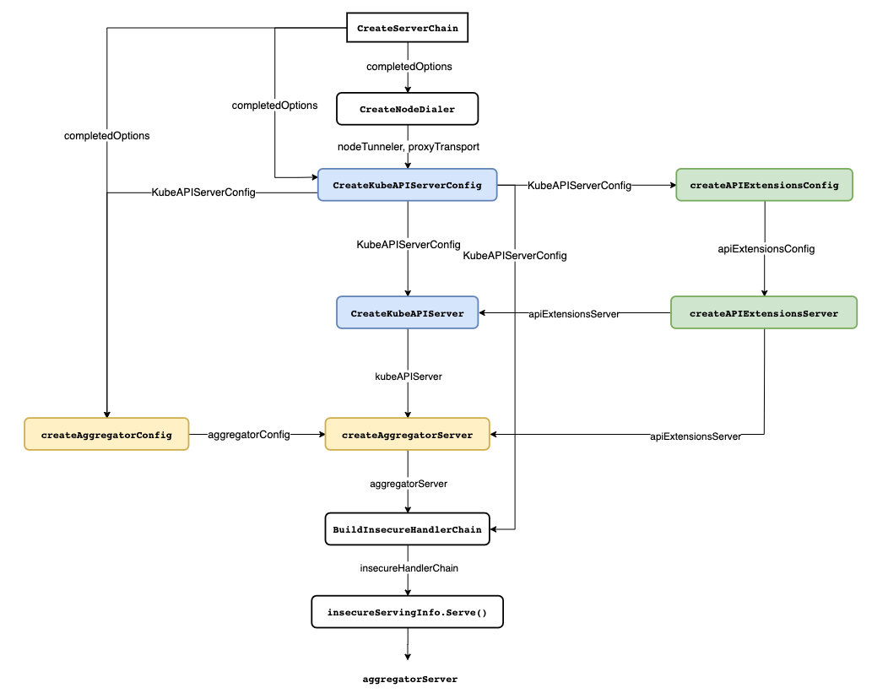
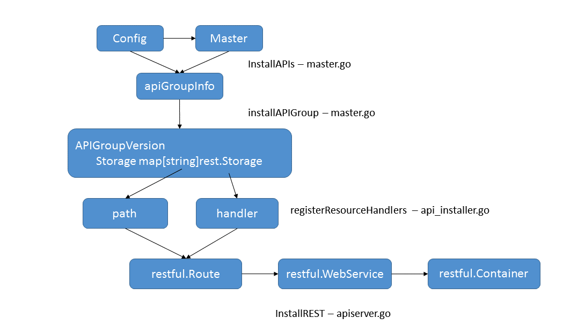

# APIServer源码分析之创建

本篇主要分析APIServer的创建过程，主要也就是`APIServer.Run()`函数中调用的`CreateServerChain()`所做的事情，参考文献已列出，如有错误欢迎指出！

</br>

## 前言

kube-APIServer包含三种APIServer：

- **kube Core APIServer核心接口服务器**

  负责对请求的一些通用处理，包括：认证、鉴权以及各个内建资源(pod, deployment，service and etc)的REST服务等。

  kubeAPIServer是kubernetes独有的API Server，它负责的是kubernetes最主要的API，官方文档里面不建议在这个里面添加和修改API。

- **apiExtensionsServer可扩展接口服务器**

  负责CustomResourceDefinition（CRD）apiResources以及apiVersions的注册，同时处理CRD以及相应CustomResource（CR）的REST请求，（如果对应CR不能被处理的话则会返回404），也是apiserver Delegation的最后一环。

- **aggregatorServer聚合服务器**

  负责处理 `apiregistration.k8s.io` 组下的APIService资源请求，同时将来自用户的请求拦截转发给aggregated server，并且负责整个 APIServer 的 Discovery 功能。

另外还包括bootstrap-controller，主要负责Kubernetes default apiserver service的创建以及管理。

整个`CreateServerChain()`函数整体也就是来构建这三个server：

```go
// CreateServerChain creates the apiservers connected via delegation.
func CreateServerChain(completedOptions completedServerRunOptions, stopCh <-chan struct{}) (*aggregatorapiserver.APIAggregator, error) {
  // 创建到节点拨号连接
	nodeTunneler, proxyTransport, err := CreateNodeDialer(completedOptions)

  // 1.创建kubeAPIServerConfig通用配置
	kubeAPIServerConfig, insecureServingInfo, serviceResolver, pluginInitializer, err := CreateKubeAPIServerConfig(completedOptions, nodeTunneler, proxyTransport)
	
  
  // 2.判断是否配置了扩展API server，创建apiExtensionsConfig配置
	apiExtensionsConfig, err := createAPIExtensionsConfig(*kubeAPIServerConfig.GenericConfig, kubeAPIServerConfig.ExtraConfig.VersionedInformers, pluginInitializer, completedOptions.ServerRunOptions, completedOptions.MasterCount,
		serviceResolver, webhook.NewDefaultAuthenticationInfoResolverWrapper(proxyTransport, kubeAPIServerConfig.GenericConfig.EgressSelector, kubeAPIServerConfig.GenericConfig.LoopbackClientConfig))
	
  // 3.启动扩展的apiExtensionsserver
	apiExtensionsServer, err := createAPIExtensionsServer(apiExtensionsConfig, genericapiserver.NewEmptyDelegate())
	
  
  // 4.启动最核心的kubeAPIServer
	kubeAPIServer, err := CreateKubeAPIServer(kubeAPIServerConfig, apiExtensionsServer.GenericAPIServer)

  
	// 5.聚合层的配置aggregatorConfig
	aggregatorConfig, err := createAggregatorConfig(*kubeAPIServerConfig.GenericConfig, completedOptions.ServerRunOptions, kubeAPIServerConfig.ExtraConfig.VersionedInformers, serviceResolver, proxyTransport, pluginInitializer)
	
  // 6.aggregatorServer,聚合服务器，对所有的服务器访问的整合
	aggregatorServer, err := createAggregatorServer(aggregatorConfig, kubeAPIServer.GenericAPIServer, apiExtensionsServer.Informers)
	
  
  // 7.启动非安全端口的server
	if insecureServingInfo != nil {
		insecureHandlerChain := kubeserver.BuildInsecureHandlerChain(aggregatorServer.GenericAPIServer.UnprotectedHandler(), kubeAPIServerConfig.GenericConfig)
    // 启动http服务
		if err := insecureServingInfo.Serve(insecureHandlerChain, kubeAPIServerConfig.GenericConfig.RequestTimeout, stopCh); err != nil {
			return nil, err
		}
	}

  // 8.返回aggregatorServer，后续启动安全端口的server
	return aggregatorServer, nil
}
```

创建过程主要有以下步骤（参考《Kubernetes源码剖析》）：

1. 根据配置构造APIServer的配置，调用方法`CreateKubeAPIServerConfig`

   这里应该是kube-apiserver不同模块实例化所需的通用配置，包括genericConfig实例化、StorageFactory存储配置、OpenAPI/Swagger配置等。

2. 根据配置构造扩展的apiserver的配置，调用方法为`createAPIExtensionsConfig`

3. 创建扩展的apiserver即APIExtensionsServer，调用方法为 `createAPIExtensionsServer`

   具体流程与KubeAPIServer的创建一致。

4. **创建KubeAPIServer，调用方法为`CreateKubeAPIServer`**

   主要就是将各个handler的路由方法注册到Container中去，完全遵循go-restful的设计模式，即将处理方法注册到Route中去，同一个根路径下的Route注册到WebService中去，WebService注册到Container中，Container负责分发。访问的过程为Container-->WebService-->Route。

5. 聚合server的配置和和创建

   主要就是将原生的apiserver和扩展的apiserver的访问进行整合，添加后续的一些处理接口。调用方法为`createAggregatorConfig`和`createAggregatorServer`；

6. 启动非安全端口server，即启动http服务

7. aggregatorServer创建完成并返回，后续启动安全端口server，即启动https服务



以上几个步骤，最核心的是APIServer具体如何创建，即如何按照`go-restful`的模式，添加路由和相应处理方法，以`CreateKubeAPIServer`方法为例，`createAPIExtensionsServer`类似。

</br>

## CreateKubeAPIServer()

KubeAPIServer 主要是提供对 API Resource 的操作请求，**为 kubernetes 中众多 API 注册路由信息，暴露 RESTful API 并且对外提供 kubernetes service**，使集群中以及集群外的服务都可以通过 RESTful API 操作 kubernetes 中的资源。

`CreateKubeAPIServer()`及其深层调用的各种逻辑可以描述为：

将`<资源组>/<资源版本>/<资源>`与资源存储对象进行映射并将其存储至APIGroupInfo对象的VersionedResourceStorageMap字段中。通过installer.Install安装器为资源注册对应的Handlers方法，完成资源和资源Handlers方法的绑定并为go-restful WebService添加路由。最后将WebService添加到go-restful Container中。

</br>

先看`CreateKubeAPIServer()`函数本身：

~~~go
// 相当于根据kubeAPIServerConfig在扩展apiserver的基础上生成kubeAPIServer
func CreateKubeAPIServer(kubeAPIServerConfig *controlplane.Config, delegateAPIServer genericapiserver.DelegationTarget) (*controlplane.Instance, error) {
  // 通过Complete方法完成配置的最终合法化,完成配置
  // New方法生成kubeAPIServer的配置
  // 这个deletgateAPIServer来自apiExtensionsServer.GenericAPIServer
	kubeAPIServer, err := kubeAPIServerConfig.Complete().New(delegateAPIServer) 
	if err != nil {
		return nil, err
	}

	return kubeAPIServer, nil
}
~~~

其中`New()`函数通过给定的配置，返回一个新的Instance接口。对于部分未配置的选项，可以使用默认配置；但是对于KubeletClientConfig这样的配置，必须手动指定。

看来主要逻辑还是在`New()`函数中，来看看：

~~~go
func (c completedConfig) New(delegationTarget genericapiserver.DelegationTarget) (*Instance, error) {
	...
	// 1.New()创建GenericAPIServer
	s, err := c.GenericConfig.New("kube-apiserver", delegationTarget)
	
	...
	// 2.实例化Instance
	m := &Instance{
		GenericAPIServer:          s,
		ClusterAuthenticationInfo: c.ExtraConfig.ClusterAuthenticationInfo,
	}
  
  // 3.注册无组名的API资源（legacy rest storage）（/api）
	if c.ExtraConfig.APIResourceConfigSource.VersionEnabled(apiv1.SchemeGroupVersion) {
		legacyRESTStorageProvider := corerest.LegacyRESTStorageProvider{
			StorageFactory:              c.ExtraConfig.StorageFactory,
			ProxyTransport:              c.ExtraConfig.ProxyTransport,
			KubeletClientConfig:         c.ExtraConfig.KubeletClientConfig,
			EventTTL:                    c.ExtraConfig.EventTTL,
			ServiceIPRange:              c.ExtraConfig.ServiceIPRange,
			SecondaryServiceIPRange:     c.ExtraConfig.SecondaryServiceIPRange,
			ServiceNodePortRange:        c.ExtraConfig.ServiceNodePortRange,
			LoopbackClientConfig:        c.GenericConfig.LoopbackClientConfig,
			ServiceAccountIssuer:        c.ExtraConfig.ServiceAccountIssuer,
			ExtendExpiration:            c.ExtraConfig.ExtendExpiration,
			ServiceAccountMaxExpiration: c.ExtraConfig.ServiceAccountMaxExpiration,
			APIAudiences:                c.GenericConfig.Authentication.APIAudiences,
		}
    // [添加/api路由]
		if err := m.InstallLegacyAPI(&c, c.GenericConfig.RESTOptionsGetter, legacyRESTStorageProvider); err != nil {
			return nil, err
		}
	}

  
	// 4.注册有组名的API资源（/apis）
	restStorageProviders := []RESTStorageProvider{
		apiserverinternalrest.StorageProvider{},
		authenticationrest.RESTStorageProvider{Authenticator: c.GenericConfig.Authentication.Authenticator, APIAudiences: c.GenericConfig.Authentication.APIAudiences},
		authorizationrest.RESTStorageProvider{Authorizer: c.GenericConfig.Authorization.Authorizer, RuleResolver: c.GenericConfig.RuleResolver},
		autoscalingrest.RESTStorageProvider{},
		batchrest.RESTStorageProvider{},
		certificatesrest.RESTStorageProvider{},
		coordinationrest.RESTStorageProvider{},
		discoveryrest.StorageProvider{},
		extensionsrest.RESTStorageProvider{},
		networkingrest.RESTStorageProvider{},
		noderest.RESTStorageProvider{},
		policyrest.RESTStorageProvider{},
		rbacrest.RESTStorageProvider{Authorizer: c.GenericConfig.Authorization.Authorizer},
		schedulingrest.RESTStorageProvider{},
		storagerest.RESTStorageProvider{},
		flowcontrolrest.RESTStorageProvider{},
		
		appsrest.StorageProvider{},
		admissionregistrationrest.RESTStorageProvider{},
		eventsrest.RESTStorageProvider{TTL: c.ExtraConfig.EventTTL},
	}
  
  // [添加新版/apis路由]
	if err := m.InstallAPIs(c.ExtraConfig.APIResourceConfigSource, c.GenericConfig.RESTOptionsGetter, restStorageProviders...); err != nil {
		return nil, err
	}

	...

	return m, nil
}
~~~

总结一下，`New()`函数主要完成的事情有：

- **创建GenericAPIServer**

  KubeAPIServer的运行依赖于GenericAPIServer，只有经过GenericAPIServer可以将k8s资源与REST API进行映射，然后通过 c.GenericConfig.New() 函数创建名为kube-apiserver的服务。

- **实例化Instance**

  KubeAPIServer通过Master/Instance对象进行管理，实例化该对象之后才能注册KubeAPIServer下的资源。

- **InstallLegacyAPI注册/api资源**

  将`/api`开头的没有组名的API注册到Container中去，如Pod、Namespace等资源。

  先判断`Core Groups/v1`是否已启用，如果已经启用则注册，目的是可以用过`http://ip:端口/api/v1`访问到`Group/v1`下的资源。

  其表现形式为`/api/< version >/< resource >`

- **InstallAPIs注册/apis资源**

  将`/apis`开头的有组名的API注册到Container中去。对于`/api`开头的路由来说，都是`/api/v1`这种统一的格式；而对于`/apis`开头路由则不一样，它包含了多种不同的格式（Kubernetes代码内叫groupName），如`/apis/apps`、`/apis/certificates.k8s.io`等各种无规律groupName。为此kubernetes提供一种`RESTStorageProvider`的工厂模式的统一接口。

  其表现形式为`/apis/< groupname >/< version >/< resource >`

</br>

### 资源注册（以InstallLegacyAPI()为例）

完整流程大致是这样的：



~~~go
// InstallLegacyAPI will install the legacy APIs for the restStorageProviders if they are enabled.
func (m *Instance) InstallLegacyAPI(c *completedConfig, restOptionsGetter generic.RESTOptionsGetter, legacyRESTStorageProvider corerest.LegacyRESTStorageProvider) error {
	// 1.通过NewLegacyRESTStorage方法创建各个资源的RESTStorage并实例化 apiGroupInfo
	legacyRESTStorage, apiGroupInfo, err := legacyRESTStorageProvider.NewLegacyRESTStorage(restOptionsGetter)
	
	...
  // 2.通过InstallLegacyAPIGroup()完成路由安装
	if err := m.GenericAPIServer.InstallLegacyAPIGroup(genericapiserver.DefaultLegacyAPIPrefix, &apiGroupInfo); err != nil {
		return fmt.Errorf("error in registering group versions: %v", err)
	}
	return nil
}
~~~

函数主要内容包括：

- **NewLegacyRESTStorage()创建RESTStorage并实例化`apiGroupInfo`**
- **InstallLegacyAPIGroup()完成路由安装**

</br>

#### NewLegacyRESTStorage()

`NewLegacyRESTStorage()`函数中主要完成**各个核心资源的RESTStorage的创建**，代码太长了不贴了：

（rest.Storage结构是用于对接etcd存储的，每个Storage都有操作ETCD的增删改查方法，比如PodStorage，NodeStorage就是操作对应pod和node在ETCD里面数据的结构，利用它们来实现对ETCD里面数据的操作）

主要处理逻辑有：

- **创建`apiGroupInfo`来描述资源组信息**

  `apiGroupInfo`对象用于描述资源组信息，该对象有一个字段 `VersionedResourcesStorageMap`，用于存储资源与资源存储对象的映射关系，比如：Pod资源<=>`/v1/pods/PodStorage`

- **创建资源存储对象`RESTStorage`**

  常见的像event、secret、namespace、endpoints等，统一调用`NewREST()`方法/`NewStorage()`方法构造相应的资源存储对象。一个资源存储对象负责一个资源的增删改查操作，当操作资源数据时候，通过对应的资源存储对象去和Store进行交互，比如：

  ~~~go
  podTemplateStorage, err := podtemplatestore.NewREST(restOptionsGetter)
  ~~~

- **存储对应关系**

  待所有资源的Storage创建完成之后，使用restStorageMap的Map类型将每个资源的api路径（非完整路径）和对应的storage对应起来，方便后续去做路由的统一规划

  ~~~go
  restStorageMap := map[string]rest.Storage{
  		"pods":             podStorage.Pod,
  		"pods/attach":      podStorage.Attach,
  		"pods/status":      podStorage.Status,
    	...
    	"services":        serviceRest,
  		"services/proxy":  serviceRestProxy,
  		"services/status": serviceStatusStorage,
    	...
  }
  ~~~

最终完成以api开头的所有资源的RESTStorage创建操作

#### InstallLegacyAPIGroup()

`InstallLegacyAPIGroup()`函数主要完成**路由的安装，即将APIGroupInfo对象中的<资源组>/<版本>/<资源>/<子资源>注册到KubeAPIServer Handlers 方法**

主要流程是：遍历APIGroupInfo，将<资源组>/<版本>/<资源名称>映射到http path请求路径，通过`InstallREST()`函数将资源存储对象作为资源的Handlers方法。最后使用go-restful的`ws.Route`将定义好的请求路径和`Handlers`方法添加路由到go-restful中（此处回忆http server内容）

主要调用链为`InstallLegacyAPIGroup-->installAPIResources-->InstallREST-->Install-->registerResourceHandlers`，最终核心的路由构造在`registerResourceHandlers`方法内。所以继续深入吧....

</br>

先来看`InstallLegacyAPIGroup()`自身的代码：

~~~go
func (s *GenericAPIServer) InstallLegacyAPIGroup(apiPrefix string, apiGroupInfo *APIGroupInfo) error {
	...
	openAPIModels, err := s.getOpenAPIModels(apiPrefix, apiGroupInfo)
	...
  // *
	if err := s.installAPIResources(apiPrefix, apiGroupInfo, openAPIModels); err != nil {
		return err
	}
	...
s.Handler.GoRestfulContainer.Add(discovery.NewLegacyRootAPIHandler(s.discoveryAddresses, s.Serializer, apiPrefix).WebService())

	return nil
}
~~~

##### installAPIResources()

`installAPIResources()`方法去注册所有前面拿到的storage

~~~go
// installAPIResources is a private method for installing the REST storage backing each api groupversionresource
func (s *GenericAPIServer) installAPIResources(apiPrefix string, apiGroupInfo *APIGroupInfo, openAPIModels openapiproto.Models) error {
	for _, groupVersion := range apiGroupInfo.PrioritizedVersions {
		...
    // apiGroupVersion里包含了所有前面注册的storage
		apiGroupVersion := s.getAPIGroupVersion(apiGroupInfo, groupVersion, apiPrefix)
		if apiGroupInfo.OptionsExternalVersion != nil {
			apiGroupVersion.OptionsExternalVersion = apiGroupInfo.OptionsExternalVersion
		}
		apiGroupVersion.OpenAPIModels = openAPIModels
		apiGroupVersion.MaxRequestBodyBytes = s.maxRequestBodyBytes
		// *
		if err := apiGroupVersion.InstallREST(s.Handler.GoRestfulContainer); err != nil {
			return fmt.Errorf("unable to setup API %v: %v", apiGroupInfo, err)
		}
	}

	return nil
}
~~~

##### InstallREST()

`InstallREST()`方法注册所有的REST处理器handler（包括storage, watch, proxy和redirect）到`restful.Container`。

~~~go
func (g *APIGroupVersion) InstallREST(container *restful.Container) error {
  // 生成url的前缀字符串，如/api/v1/
	prefix := path.Join(g.Root, g.GroupVersion.Group, g.GroupVersion.Version)
	installer := &APIInstaller{
		group:             g,
		prefix:            prefix,
		minRequestTimeout: g.MinRequestTimeout,
	}
	// * 完成资源和资源Handlers方法的绑定
	apiResources, ws, registrationErrors := installer.Install()
	versionDiscoveryHandler := discovery.NewAPIVersionHandler(g.Serializer, g.GroupVersion, staticLister{apiResources})
  // 为go-restful WebService添加路由
	versionDiscoveryHandler.AddToWebService(ws)
  // 将WebService添加到go-restful Container中
	container.Add(ws)
	return utilerrors.NewAggregate(registrationErrors)
}
~~~

其中涉及到几个概念：


- **Container**

  Container代表一个http rest服务对象，相当于一个http server，不同的container监控不同的地址和端口。它包括一组restful.WebService和一个http.ServeMux对象，每个webserver处理一个对应路径下的所有请求，使用RouteSelector类型成员router进行请求派发。

  ~~~go
  type Container struct {
      webServicesLock        sync.RWMutex
      webServices            []*WebService
      ServeMux               *http.ServeMux
      isRegisteredOnRoot     bool
      containerFilters       []FilterFunction
      doNotRecover           bool
      recoverHandleFunc      RecoverHandleFunction
      serviceErrorHandleFunc ServiceErrorHandleFunction
      router                 RouteSelector
      contentEncodingEnabled bool
  }
  ~~~

- **restful.WebService**

  WebService逻辑上由多个restful.Route组成，功能上主要是为一组Route统一设置包括root path，请求响应的数据类型等一些通用的属性。需要注意的是，WebService必须加入到Container中才能生效。

- **restful.Route**

  一种Route的设定包含：请求方法(http Method)，请求路径(URL Path),输入输出类型(JSON/YAML)以及对应的回调函数(restful.RouteFunction)，响应内容类型(Accept)等，在实际实现的时候就是paths数组<br />同后端的restful.RouteFunction的绑定，Restful请求最终转换成对后端数据库rest.Storage的访问操作。

  ```go
  // Route binds a HTTP Method,Path,Consumes combination to a RouteFunction.
  type Route struct {
  	Method   string
  	...
  	Path     string // webservice root path + described path
  	Function RouteFunction
  	...
  }
  ```

</br>

##### Install()

~~~go
// Install handlers for API resources.
func (a *APIInstaller) Install() ([]metav1.APIResource, *restful.WebService, []error) {
	var apiResources []metav1.APIResource
	var errors []error
  // 生成新的webService对象
	ws := a.newWebService()

  // 将storage里的所有api路径放入paths数组，然后排序
	paths := make([]string, len(a.group.Storage))
	var i int = 0
	for path := range a.group.Storage {
		paths[i] = path
		i++
	}
	sort.Strings(paths)
 
  // 循环遍历path数组，注册每个path对应的handler，注册好之后放到前面新建的webService里
	for _, path := range paths {
    // * 完成资源和资源Handlers方法的绑定
		apiResource, err := a.registerResourceHandlers(path, a.group.Storage[path], ws)
		
		if apiResource != nil {
			apiResources = append(apiResources, *apiResource)
		}
	}
	return apiResources, ws, errors
}
~~~

##### registerResourceHandlers()

这是一个非常经典且复杂的方法（`/vendor/k8s.io/apiserver/pkg/endpoint/install.go`），整个方法的代码在700行左右。

方法的主要功能是通过上一步骤构造的RESTStorage判断该资源可以执行哪些操作（如create、update、connecte、patch等），将其对应支持的操作存入到actions，每一个action对应一个标准的rest操作(GET, PUT, POST, DELETE, PATCH, CONNECT....)，如create对应的action操作为POST、update对应的action操作为PUT。最终根据actions数组依次遍历，对每一个action创建一个handler方法，注册到route中去，route注册到webservice中去，完美匹配go-restful的设计模式。

太长了啊......

```go
func (a *APIInstaller) registerResourceHandlers(path string, storage rest.Storage, ws *restful.WebService) (*metav1.APIResource, error) {
   ...
  
   // what verbs are supported by the storage, used to know what verbs we support per path
   // 1.调用storage的动作方法，进一步可以判断是否支持这些方法
   // 若此storage支持get方法则得到Getter结构，其他例如create，update，delete这些动作若支持也会得到相应结构体
   // 不同的方法对应着etcd的不同操作
   creater, isCreater := storage.(rest.Creater)
   namedCreater, isNamedCreater := storage.(rest.NamedCreater)
   lister, isLister := storage.(rest.Lister)
   getter, isGetter := storage.(rest.Getter)
   getterWithOptions, isGetterWithOptions := storage.(rest.GetterWithOptions)
   gracefulDeleter, isGracefulDeleter := storage.(rest.GracefulDeleter)
   collectionDeleter, isCollectionDeleter := storage.(rest.CollectionDeleter)
   updater, isUpdater := storage.(rest.Updater)
   patcher, isPatcher := storage.(rest.Patcher)
   watcher, isWatcher := storage.(rest.Watcher)
   connecter, isConnecter := storage.(rest.Connecter)
   storageMeta, isMetadata := storage.(rest.StorageMetadata)
   storageVersionProvider, isStorageVersionProvider := storage.(rest.StorageVersionProvider)
   ...
  
   // 新建actions数组，往此数组里面添加所有的action
   // 这些action是GET,PUT,DELETE,CONNECT等这些REST请求对应的actionn
   actions := []action{}
   
  /* action的结构
  type action struct {
    Verb          string //动作
    Path          string // 路径
    Params        []*restful.Parameter
    Namer         handlers.ScopeNamer
    AllNamespaces bool
	}
	*/
   ...

   // Get the list of actions for the given scope.
   switch {
   case !namespaceScoped:
      ....
   default:
      namespaceParamName := "namespaces"
      // Handler for standard REST verbs (GET, PUT, POST and DELETE).
      namespaceParam := ws.PathParameter("namespace", "object name and auth scope, such as for teams and projects").DataType("string")
      namespacedPath := namespaceParamName + "/{namespace}/" + resource
      namespaceParams := []*restful.Parameter{namespaceParam}

      resourcePath := namespacedPath
      resourceParams := namespaceParams
      itemPath := namespacedPath + "/{name}"
      nameParams := append(namespaceParams, nameParam)
      proxyParams := append(nameParams, pathParam)
      itemPathSuffix := ""
      if isSubresource {
         itemPathSuffix = "/" + subresource
         itemPath = itemPath + itemPathSuffix
         resourcePath = itemPath
         resourceParams = nameParams
      }
      apiResource.Name = path
      apiResource.Namespaced = true
      apiResource.Kind = resourceKind
      namer := handlers.ContextBasedNaming{
         SelfLinker:         a.group.Linker,
         ClusterScoped:      false,
         SelfLinkPathPrefix: gpath.Join(a.prefix, namespaceParamName) + "/",
         SelfLinkPathSuffix: itemPathSuffix,
      }

     	// 然后新建一个action数组并往此数组里面添加所有的action，这些action即GET,PUT和DELETE这些REST请求对应的actionn
      actions = appendIf(actions, action{"LIST", resourcePath, resourceParams, namer, false}, isLister)
      actions = appendIf(actions, action{"POST", resourcePath, resourceParams, namer, false}, isCreater)
      actions = appendIf(actions, action{"DELETECOLLECTION", resourcePath, resourceParams, namer, false}, isCollectionDeleter)
      // DEPRECATED in 1.11
      actions = appendIf(actions, action{"WATCHLIST", "watch/" + resourcePath, resourceParams, namer, false}, allowWatchList)

      actions = appendIf(actions, action{"GET", itemPath, nameParams, namer, false}, isGetter)
      if getSubpath {
         actions = appendIf(actions, action{"GET", itemPath + "/{path:*}", proxyParams, namer, false}, isGetter)
      }
      actions = appendIf(actions, action{"PUT", itemPath, nameParams, namer, false}, isUpdater)
      actions = appendIf(actions, action{"PATCH", itemPath, nameParams, namer, false}, isPatcher)
      actions = appendIf(actions, action{"DELETE", itemPath, nameParams, namer, false}, isGracefulDeleter)
      // DEPRECATED in 1.11
      actions = appendIf(actions, action{"WATCH", "watch/" + itemPath, nameParams, namer, false}, isWatcher)
      actions = appendIf(actions, action{"CONNECT", itemPath, nameParams, namer, false}, isConnecter)
      actions = appendIf(actions, action{"CONNECT", itemPath + "/{path:*}", proxyParams, namer, false}, isConnecter && connectSubpath)

      ...

     // 然后遍历数组actions，在循环每种动作action（例如get）的逻辑里面先创建一个此action对应的处理器handler
     // 然后通过webService和此handler创建一个route结构，此route结构即为当前path对应到此action的一个路由
      switch action.Verb {
      case "GET": // Get a resource.
         // 创建一个此action对应的处理器handler
         var handler restful.RouteFunction
         if isGetterWithOptions {
            handler = restfulGetResourceWithOptions(getterWithOptions, reqScope, isSubresource)
         } else {
            handler = restfulGetResource(getter, exporter, reqScope)
         }

         ...
        // 通过webService和此handler创建一个route结构
        // 注册后，处理Xpath上的GET请求的时候就调用handler
         route := ws.GET(action.Path).To(handler).
            Doc(doc).
            Param(ws.QueryParameter("pretty", "If 'true', then the output is pretty printed.")).
            Operation("read"+namespaced+kind+strings.Title(subresource)+operationSuffix).
            Produces(append(storageMeta.ProducesMIMETypes(action.Verb), mediaTypes...)...).
            Returns(http.StatusOK, "OK", producedObject).
            Writes(producedObject)
         ...
        
         addParams(route, action.Params)
         routes = append(routes, route)
      case "LIST": // List all resources of a kind.        
      case "PUT": // Update a resource.       
      case "PATCH": // Partially update a resource      
      case "POST": // Create a resource.        
      case "DELETE": // Delete a resource.        
      case "DELETECOLLECTION":        
      case "WATCH": // Watch a resource.        
      case "WATCHLIST": // Watch all resources of a kind.        
      case "CONNECT": 
      default:
      
      ...   

     // 循环遍历actions数组之后将所有route添加到当前路径对应的webService中
     for _, route := range routes {
			route.Metadata(ROUTE_META_GVK, metav1.GroupVersionKind{
				Group:   reqScope.Kind.Group,
				Version: reqScope.Kind.Version,
				Kind:    reqScope.Kind.Kind,
			})
			route.Metadata(ROUTE_META_ACTION, strings.ToLower(action.Verb))
			ws.Route(route)
		}
	}

  ....

   return &apiResource, nil
}
```

</br>

其中，route加入到webService之后，怎么加入Container，Container又是怎么被识别的？具体内容参考：[APIServer路由请求实现](file:APIServer路由请求实现)

至此API的注册过程全部结束，后面APIServer接收到一个rest请求就会根据RestfulContainer里面的handler来进行处理。

</br>

</br>

## Refs

[kubernetes源码阅读笔记：理清 kube-apiserver 的源码主线](https://cloud.tencent.com/developer/article/1326541)

[Kubernetes源码分析之kube-apiserver](https://juejin.cn/post/6844903801934069774)

[Kubernetes API源码学习笔记](https://www.cnblogs.com/zard/p/7738468.html)

[kubernetes之kube-ApiServer代码分析](https://www.cnblogs.com/chris-cp/p/6108821.html)

[kube-apiserver启动流程分析](https://blog.csdn.net/u012986012/article/details/105755991)

[kubernetes-kube-apiserver进程源码分析](https://blog.csdn.net/hahachenchen789/article/details/87532035)


