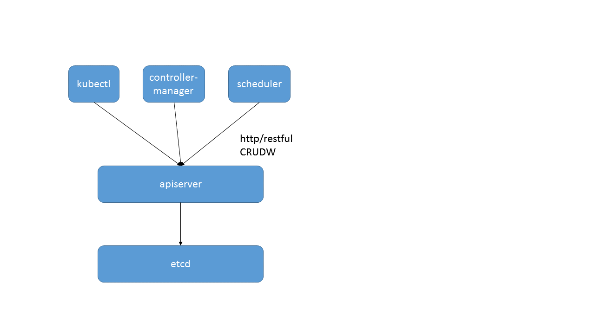
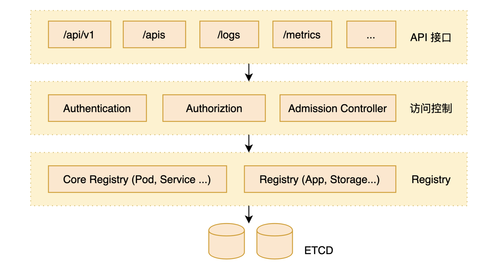

# All About APIServer

> 本篇文章为笔者综合网上/书上的内容所整理得出，部分参考文献在文章中给出，如有理解错误之处欢迎指出！

</br>

## APIServer是什么？

Kubernetes API Server 通过名为 kube-apiserver 进程提供服务，它的核心功能是提供**集群管理 RESTful API 接口**，将 API 操作的对象存储到持久化存储到 ETCD 后端，本质是集群中所有用户和组件的数据交互中心。

kube-apiserver作为整个Kubernetes集群操作etcd的唯一入口，负责Kubernetes各资源的认证&鉴权，校验以及CRUD等操作，提供RESTful APIs，供其它组件调用。



APIServer本质其实是一个负责监听（http/https）指定端口的server，之后处理不同的请求。

至于什么是Server？文章参考：[HTTP Server的理解](file:HTTPServer的理解)

</br>

## 整体架构

Kubernetes API Server 从上到下可以分为四层：接口层，访问控制层，注册表层和数据库层。



### API接口层

整个kubeAPIServer提供了三类API Resource接口：

- core group：主要在 `/api/v1` 下；
- named groups：其 path 为 `/apis/$GROUP/$VERSION`；
- 系统状态的一些 API：如`/metrics` 、`/version` 等；

具体API资源细节参考：[Kubernetes API Reference Docs](https://kubernetes.io/docs/reference/generated/kubernetes-api/v1.20/#-strong-api-overview-strong-)

kubeAPIServer会为每种API资源创建对应的RESTStorage，RESTStorage的目的是将每种资源的访问路径及其后端存储的操作对应起来。API的访问URL大致以 `/apis/{group}/{version}/namespaces/{namespace}/resource/{name}` 组成，通过这个路径就可以访问到具体的资源。具体的API资源注册过程在APIServer的创建中实现。

### 访问控制层

访问控制层对用户进行身份鉴权，然后根据配置的各种访问许可逻辑（Admission Controller），判断是否允许访问。当请求到达 kube-apiserver 时，kube-apiserver 首先会执行在 http filter chain 中注册的过滤器链，该过滤器对其执行一系列过滤操作，主要有认证、鉴权等检查操作。

> 有关证书的内容看一看...

### 注册表层

Kubernetes 把所有资源都保存在注册表（Registry）中，针对注册表中的各种资源对象，都定义了相应的资源对象类型，以及如何创建资源，转换不同版本的资源，编码解码资源。

### ETCD数据库层

通过 KV 持久化存储 Kubernetes 对象，API Server 就是利用 ETCD 的 Watch 特性实现了经典 List-Watch 机制。

List-Watch 机制内容参考：[关于informer的分享](file:关于informer的分享)

在有了rest.Storage之后，其仅仅是一个接口，又何德何能可以真正的操作etcd呢？文章参考：[APIServer与etcd的交互](file:APIServer与etcd的交互)

</br>

## 创建/启动流程

我们知道，APIServer其实就是一个负责监听（http/https）指定端口的server，之后处理不同的请求，所以所有代码核心就是如何配置server，包括路由、访问权限以及同数据库（etcd）的交互等。那么一个server的创建和启动过程是怎么实现的？先看一下源码的大致走向。

程序入口在`/cmd/kube-apiserver/apierver.go`的`command := app.NewAPIServerCommand()`

其中`command.Execute()`会最终调用cmd的`RunE()`字段：

```go
// Run runs the specified APIServer.  This should never exit.
func Run(completeOptions completedServerRunOptions, stopCh <-chan struct{}) error {
  ...
  // 1.创建了一个server
	server, err := CreateServerChain(completeOptions, stopCh)
	...
  // 2.注册handler，执行hook等，返回一个preparedGenericAPIServer
	prepared, err := server.PrepareRun()
	...
  // 3.启动server
	return prepared.Run(stopCh)
}
```

其中包括主要步骤为：

1. 调用`CreateServerChain`构建服务调用链，并判断是否启动非安全的`httpserver`，`httpserver`链中包含 apiserver要启动的三个server，以及为每个server注册对应资源的路由；
2. 调用`server.PrepareRun`进行服务运行前的准备，该方法主要完成了健康检查，存活检查和OpenAPI路由的注册工作；
3. 调用`prepared.Run`启动server；

其中：

第一步具体实现分析参考：[APIServer源码分析之创建](file:APIServer源码分析之创建)

第二、三两步具体实现分析参考：[APIServer源码分析之启动](file:APIServer源码分析之启动)

</br>

## 执行流程

以上内容介绍了APIServer的创建流程，现在我们来看看当一个请求过来的时候，最终是怎么作用到后端存储上的。

### Create Pod 流程

</br>

### Watch Pod 流程

</br>


</br>

</br>

## 内容总览

[HTTP Server的理解](file:HTTPServer的理解)

[关于informer的分享](file:关于informer的分享)

[APIServer与etcd的交互](file:APIServer与etcd的交互)

[APIServer源码分析之创建](file:APIServer源码分析之创建)

​		- [APIServer路由请求实现](file:APIServer路由请求实现)

[APIServer源码分析之启动](file:APIServer源码分析之启动)


