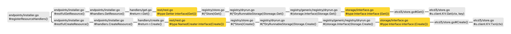

# Handler处理响应实现思路

</br></br>


## apiserver实现思路

下图是注册路由过程中`handler`的生成以及具体链接到后端`etcd`进行操作的调用过程（以get和create方法为例）



### 1.长函数

长函数`registerResourceHandlers()`（定位：`/staging/src/k8s.io/apiserver/pkg/endpoints/install.go #185`）中间涉及到一步是进行handler和路径的绑定，具体是：根据actions数组依次遍历，对每一个操作（Get/List....）绑定一个handler方法：

```go
case "GET": // Get a resource.
			var handler restful.RouteFunction
			if isGetterWithOptions {
				handler = restfulGetResourceWithOptions(getterWithOptions, reqScope, isSubresource)
			} else {
        // *[逻辑总结]
        // 这里返回的是一个RouteFunction类型函数（规定传入参数是[*Request, *Response]）
        // 内层是返回的http.HandlerFunc()类型（规定传入参数是[ResponseWriter, *Request]）
        // 在最终调用这个Route.Function()处理逻辑的时候，实际上调用的是这个handler
        // 这个handler内部实际执行的是handlers.GetResource(r, e, &scope)(res.ResponseWriter, req.Request)
        // 这个子函数是个HandlerFunc类型的函数
        // 所以执行这个handler就是执行该子函数，该子函数的逻辑实则是在getResourceHandler()里
        // getResourceHandler()中就进行”取出obj“这个动作
				handler = restfulGetResource(getter, exporter, reqScope)
			}
			//=============================此段不属于此函数===============================
               type HandlerFunc func(ResponseWriter, *Request)

							 // 调用HandlerFunc.ServeHTTP()就是执行HandlerFunc函数
							 // 利用这种类型转换，我们可以将一个 handler 函数转换为一个Handler 对象
               func (f HandlerFunc) ServeHTTP(w ResponseWriter, r *Request) {
                 f(w, r)
               }
			//=========================================================================
			...
			doc := "read the specified " + kind
			if isSubresource {
				doc = "read " + subresource + " of the specified " + kind
			}
			route := ws.GET(action.Path).To(handler).
				Doc(doc).
				Param(ws.QueryParameter("pretty", "If 'true', then the output is pretty printed.")).
				Operation("read"+namespaced+kind+strings.Title(subresource)+operationSuffix).
				Produces(append(storageMeta.ProducesMIMETypes(action.Verb), mediaTypes...)...).
				Returns(http.StatusOK, "OK", producedObject).
				Writes(producedObject)
			if isGetterWithOptions {
				if err := AddObjectParams(ws, route, versionedGetOptions); err != nil {
					return nil, err
				}
			}
			if isExporter {
				if err := AddObjectParams(ws, route, versionedExportOptions); err != nil {
					return nil, err
				}
			}
			addParams(route, action.Params)
			routes = append(routes, route)
		 ....
```

~~~~go
func restfulGetResource(r rest.Getter, e rest.Exporter, scope handlers.RequestScope) restful.RouteFunction {
	return func(req *restful.Request, res *restful.Response) {
    // 调用handlers包的函数，handlers包是具体实现：怎么处理请求并转发给rest.storage + 构造响应返回 的地方
		handlers.GetResource(r, e, &scope)(res.ResponseWriter, req.Request)
	}
}
~~~~

### 2.handlers包

以Get方法为例，这两个函数调用关系很乱，仔细品品！

~~~go
// GetResource returns a function that handles retrieving a single resource from a rest.Storage object.
func GetResource(r rest.Getter, e rest.Exporter, scope *RequestScope) http.HandlerFunc {
  
  // 结构：getResourceHandler(scope, func())
	return getResourceHandler(scope,
		func(ctx context.Context, name string, req *http.Request, trace *utiltrace.Trace) (runtime.Object, error) {
      
			// check for export
      options := metav1.GetOptions{} // 创建一个GetOptions结构体
      
      /*  ===暂不看===
			if values := req.URL.Query(); len(values) > 0 {
				exports := metav1.ExportOptions{}
				if err := metainternalversionscheme.ParameterCodec.DecodeParameters(values, scope.MetaGroupVersion, &exports); err != nil {
					err = errors.NewBadRequest(err.Error())
					return nil, err
				}
				if exports.Export {
					if e == nil {
						return nil, errors.NewBadRequest(fmt.Sprintf("export of %q is not supported", scope.Resource.Resource))
					}
					return e.Export(ctx, name, exports)
				}
				if err := metainternalversionscheme.ParameterCodec.DecodeParameters(values, scope.MetaGroupVersion, &options); err != nil {
					err = errors.NewBadRequest(err.Error())
					return nil, err
				}
			}
			if trace != nil {
				trace.Step("About to Get from storage")
			}
      */ 
      
      // *
			return r.Get(ctx, name, &options)
		})
}
~~~

~~~go
// 后
func getResourceHandler(scope *RequestScope, getter getterFunc) http.HandlerFunc {
	return func(w http.ResponseWriter, req *http.Request) {
		trace := utiltrace.New("Get", utiltrace.Field{Key: "url", Value: req.URL.Path}, utiltrace.Field{Key: "user-agent", Value: &lazyTruncatedUserAgent{req}}, utiltrace.Field{Key: "client", Value: &lazyClientIP{req}})
		defer trace.LogIfLong(500 * time.Millisecond)

		namespace, name, err := scope.Namer.Name(req)
		...
		ctx := req.Context()
		ctx = request.WithNamespace(ctx, namespace)

		outputMediaType, _, err := negotiation.NegotiateOutputMediaType(req, scope.Serializer, scope)
		...

    // getter是上面传入的函数
		result, err := getter(ctx, name, req, trace)
		...

		trace.Step("About to write a response")
    // 取回obj后写入响应，这里后边7介绍
    // 这边的w的传入是调用handler这个函数的时候传入的，长函数这边只是在绑定handler和路径
    // 但具体谁在什么时候会调用这个handler就要看ListenAndServe()函数，见8
		transformResponseObject(ctx, scope, trace, req, w, http.StatusOK, outputMediaType, result)
		trace.Step("Transformed response object")
	}
}
~~~

### 3.REST Getter接口

来看看实际从后端存储取obj的操作：`r.Get()`函数实现了`rest.go/Getter`接口：

```go
// Getter is an object that can retrieve a named RESTful resource.
type Getter interface {
   // Get finds a resource in the storage by name and returns it.
   // Although it can return an arbitrary error value, IsNotFound(err) is true for the
   // returned error value err when the specified resource is not found.
   Get(ctx context.Context, name string, options *metav1.GetOptions) (runtime.Object, error)
}
```

其中`Getter`又包含在`StandardStorage`接口中：（此阶段只需要解决`Getter`、`Lister`、`Watcher`）

```go
// StandardStorage is an interface covering the common verbs. Provided for testing whether a
// resource satisfies the normal storage methods. Use Storage when passing opaque storage objects.
type StandardStorage interface {
   Getter
   Lister
   CreaterUpdater
   GracefulDeleter
   CollectionDeleter
   Watcher
}
```

### 4.registry/store.go

现在有了调用`Get()`的代码，但是具体的`Get()`实现逻辑在哪里呢？由于操作`etcd`存储需要通过`Storage`这个结构，所以调用了`Get()`就会链接到相应资源的`Storage`的Get方法的具体实现。

先来看`Store`的结构：`registry/store.go`里有一个`Store`结构体，实现了`Get()`、` Create()`、` List()`等方法。

```go
// staging/src/k8s.io/apiserver/pkg/registry/generic/registry/store.go
type Store struct {
   NewFunc func() runtime.Object
   NewListFunc func() runtime.Object
   ...
   // Storage is the interface for the underlying storage for the
   // resource. It is wrapped into a "DryRunnableStorage" that will
   // either pass-through or simply dry-run.
   Storage DryRunnableStorage
   
   StorageVersioner runtime.GroupVersioner
   ...
}
```

其中有一个`DryRunnableStorage`类型的成员`Storage`，再看`DryRunnableStorage`结构体：

```go
type DryRunnableStorage struct {
   Storage storage.Interface
   Codec   runtime.Codec
}
```

里面才有最根本的`storage.Interface`类型的`Storage`。`Interface`接口提供了`Get()`、`List()`等方法

```go
type Interface interface {
   Versioner() Versioner
   Create(ctx context.Context, key string, obj, out runtime.Object, ttl uint64) error
   Delete(ctx context.Context, key string, out runtime.Object, preconditions *Preconditions, validateDeletion ValidateObjectFunc) error
   Watch(ctx context.Context, key string, opts ListOptions) (watch.Interface, error)
   WatchList(ctx context.Context, key string, opts ListOptions) (watch.Interface, error)
   Get(ctx context.Context, key string, opts GetOptions, objPtr runtime.Object) error
   GetToList(ctx context.Context, key string, opts ListOptions, listObj runtime.Object) error
   List(ctx context.Context, key string, opts ListOptions, listObj runtime.Object) error
   GuaranteedUpdate(
      ctx context.Context, key string, ptrToType runtime.Object, ignoreNotFound bool,
      precondtions *Preconditions, tryUpdate UpdateFunc, suggestion ...runtime.Object) error
   Count(key string) (int64, error)
}
```

回到刚开始`Store`结构体实现的`Get()`方法，来看看具体做了什么事情：

```go
// Get retrieves the item from storage.
func (e *Store) Get(ctx context.Context, name string, options *metav1.GetOptions) (runtime.Object, error) {
   // 返回一个runtime.Object类型的接口，任何一个api资源都需要实现这个接口，
   obj := e.NewFunc()
   // 返回特定对象的键值
   key, err := e.KeyFunc(ctx, name)
   ...
   // *
   // Get到的对象应该在obj里
   if err := e.Storage.Get(ctx, key, storage.GetOptions{ResourceVersion: options.ResourceVersion}, obj); err != nil {
      return nil, storeerr.InterpretGetError(err, e.qualifiedResourceFromContext(ctx), name)
   }
   if e.Decorator != nil {
     // Decorator()操作
      if err := e.Decorator(obj); err != nil {
         return nil, err
      }
   }
   return obj, nil
}
```

### 5.registry/dryrun.go

这里隔了一层`dryrun`层，有些方法直接调用`s.Storage.Get(ctx, key, opts, objPtr)`，有些方法比如`create()`在创建前则需要判断下在`Storage`中是否已经存在相应的键，比如：

```go
func (s *DryRunnableStorage) Get(ctx context.Context, key string, opts storage.GetOptions, objPtr runtime.Object) error {
  // 会返回一个对象
	return s.Storage.Get(ctx, key, opts, objPtr)
}

func (s *DryRunnableStorage) Create(ctx context.Context, key string, obj, out runtime.Object, ttl uint64, dryRun bool) error {
   if dryRun {
      if err := s.Storage.Get(ctx, key, storage.GetOptions{}, out); err == nil {
         return storage.NewKeyExistsError(key, 0)
      }
      return s.copyInto(obj, out)
   }
   return s.Storage.Create(ctx, key, obj, out, ttl)
}
```

`s.Storage.Get()`会调用`DryRunnableStorage`结构体中的`storage.Interface`类型的`Storage`成员的`Get()`方法，`Interface`接口上面已经展示，但具体的函数逻辑需要通过后续后端存储`etcd`来实现。

### 6.etcd3/store.go

有了`Storage`对象之后就可以操作具体的`etcd`了，由于现在后端存储基本上是`etcd3`，所以来看看`etcd3`中不同操作的具体实现逻辑：

`etcd3/store.go`中有一个`store`结构体：

~~~go
// staging/src/k8s.io/apiserver/pkg/storage/etcd3/store.go
type store struct {
    client        *clientv3.Client
    codec         runtime.Codec
    versioner     storage.Versioner
    transformer   value.Transformer
    pathPrefix    string
    watcher       *watcher
    pagingEnabled bool
    leaseManager  *leaseManager
}
~~~

这个`store`提供了众多方法的实现，比如`Get()`方法：

```go
// Get implements storage.Interface.Get.
func (s *store) Get(ctx context.Context, key string, opts storage.GetOptions, out runtime.Object) error {
   key = path.Join(s.pathPrefix, key)
   startTime := time.Now()
   // 通过client去操作键值对存储库
   getResp, err := s.client.KV.Get(ctx, key)
   metrics.RecordEtcdRequestLatency("get", getTypeName(out), startTime)
   ...
   if err = s.validateMinimumResourceVersion(opts.ResourceVersion, uint64(getResp.Header.Revision)); err != nil {
      return err
   }

   if len(getResp.Kvs) == 0 {
      if opts.IgnoreNotFound {
         return runtime.SetZeroValue(out)
      }
      return storage.NewKeyNotFoundError(key, 0)
   }
   kv := getResp.Kvs[0]

   data, _, err := s.transformer.TransformFromStorage(kv.Value, authenticatedDataString(key))
   if err != nil {
      return storage.NewInternalError(err.Error())
   }
	 
   // 取回的data需要经过decode解密（将字节的值转化为对象）再返回
   return decode(s.codec, s.versioner, data, out, kv.ModRevision)
}
```

至此，`handler`怎么通过层层调用去操作`etcd`的过程结束，回到2中，现在已经取回obj，然后需要构造响应并返回。

### 7.构建响应

```go
// 前文回顾========================
		// getter是上面传入的函数
		result, err := getter(ctx, name, req, trace)
		...
		trace.Step("About to write a response")
    // 取回obj后写入响应，这里后边介绍
		// 这边的w的传入是调用handler这个函数的时候传入的
		transformResponseObject(ctx, scope, trace, req, w, http.StatusOK, outputMediaType, result)
		trace.Step("Transformed response object")
// 前文回顾========================

// transformResponseObject takes an object loaded from storage and performs any necessary transformations.
// Will write the complete response object.
func transformResponseObject(ctx context.Context, scope *RequestScope, trace *utiltrace.Trace, req *http.Request, w http.ResponseWriter, statusCode int, mediaType negotiation.MediaTypeOptions, result runtime.Object) {
   // 这里会传入一个 w http.ResponseWriter ，用于写入响应并返回
   options, err := optionsForTransform(mediaType, req)
   ...
   obj, err := transformObject(ctx, result, options, mediaType, scope, req)
   ...
   kind, serializer, _ := targetEncodingForTransform(scope, mediaType, req)
   // *
   // 写入响应
   responsewriters.WriteObjectNegotiated(serializer, scope, kind.GroupVersion(), w, req, statusCode, obj)
}
```

具体响应构造过程：

```go
// WriteObjectNegotiated renders an object in the content type negotiated by the client.
func WriteObjectNegotiated(s runtime.NegotiatedSerializer, restrictions negotiation.EndpointRestrictions, gv schema.GroupVersion, w http.ResponseWriter, req *http.Request, statusCode int, object runtime.Object) {
   // 取出数据流
   stream, ok := object.(rest.ResourceStreamer)
   if ok {
      // 获取请求内容
      requestInfo, _ := request.RequestInfoFrom(req.Context())
      metrics.RecordLongRunning(req, requestInfo, metrics.APIServerComponent, func() {
         StreamObject(statusCode, gv, s, stream, w, req)
      })
      return
   }

   _, serializer, err := negotiation.NegotiateOutputMediaType(req, s, restrictions)
   if err != nil {
      // if original statusCode was not successful we need to return the original error
      // we cannot hide it behind negotiation problems
      if statusCode < http.StatusOK || statusCode >= http.StatusBadRequest {
         WriteRawJSON(int(statusCode), object, w)
         return
      }
      status := ErrorToAPIStatus(err)
      WriteRawJSON(int(status.Code), status, w)
      return
   }

   if ae := request.AuditEventFrom(req.Context()); ae != nil {
      audit.LogResponseObject(ae, object, gv, s)
   }

   // 转化成字符串
   encoder := s.EncoderForVersion(serializer.Serializer, gv)
   // 序列化对象，这边的实质内容应该在w中，结束会返回
   SerializeObject(serializer.MediaType, encoder, w, req, statusCode, object)
}
```

### 8.Server服务过程

以上内容都是`handler`的相关过程，没有涉及到`server`监听请求并调用`handler`的过程，以下进行介绍。

#### 开启服务

在构建apiserver的过程中最后需要启动服务，会涉及到一个函数：

```go
func RunServer(
   server *http.Server,
   ln net.Listener,
   shutDownTimeout time.Duration,
   stopCh <-chan struct{},
) (<-chan struct{}, error) {
   ...
   // Shutdown server gracefully.
   stoppedCh := make(chan struct{})
   go func() {
      defer close(stoppedCh)
      <-stopCh
      ctx, cancel := context.WithTimeout(context.Background(), shutDownTimeout)
      server.Shutdown(ctx)
      cancel()
   }()

   go func() {
      defer utilruntime.HandleCrash()

      var listener net.Listener
      listener = tcpKeepAliveListener{ln}
      ...
      // *
      err := server.Serve(listener)

      ...
   }()

   return stoppedCh, nil
}
```

重点是`Serve()`，来看`Server`结构

~~~go
type Server struct {
    Addr              string //地址
    Handler           Handler // 处理函数
    TLSConfig         *tls.Config
    ...
    mu                sync.Mutex
    listeners         map[*net.Listener]struct{}
    ...
}
~~~

Server结构体有`ListenAndServe() `和`Serve()`函数，`ListenAndServe()`函数会调用`Serve()`函数，即真正服务逻辑在`Serve()`函数：

首先创建一个上下文对象，然后调用 `Listener` 的 `Accept()` 等待新的连接建立；一旦有新的连接建立，则调用 `Server` 的 `newConn()` 创建新的连接对象，并将连接的状态标志为 `StateNew` ，然后开启一个新的 `goroutine` 处理连接请求。

```go
func (srv *Server) Serve(l net.Listener) error {
   /*
   if fn := testHookServerServe; fn != nil {
      fn(srv, l) // call hook with unwrapped listener
   }

   origListener := l
   l = &onceCloseListener{Listener: l}
   defer l.Close()

   if err := srv.setupHTTP2_Serve(); err != nil {
      return err
   }

   if !srv.trackListener(&l, true) {
      return ErrServerClosed
   }
   defer srv.trackListener(&l, false)
   */
  
   baseCtx := context.Background()
   if srv.BaseContext != nil {
      baseCtx = srv.BaseContext(origListener)
      if baseCtx == nil {
         panic("BaseContext returned a nil context")
      }
   }

   var tempDelay time.Duration // how long to sleep on accept failure

   ctx := context.WithValue(baseCtx, ServerContextKey, srv)
   for {
      rw, err := l.Accept()
      /*
      if err != nil {
         select {
         case <-srv.getDoneChan():
            return ErrServerClosed
         default:
         }
         if ne, ok := err.(net.Error); ok && ne.Temporary() {
            if tempDelay == 0 {
               tempDelay = 5 * time.Millisecond
            } else {
               tempDelay *= 2
            }
            if max := 1 * time.Second; tempDelay > max {
               tempDelay = max
            }
            srv.logf("http: Accept error: %v; retrying in %v", err, tempDelay)
            time.Sleep(tempDelay)
            continue
         }
         return err
      }
      connCtx := ctx
      if cc := srv.ConnContext; cc != nil {
         connCtx = cc(connCtx, rw)
         if connCtx == nil {
            panic("ConnContext returned nil")
         }
      }
      tempDelay = 0
      */
     
      c := srv.newConn(rw)
      c.setState(c.rwc, StateNew) // before Serve can return
      go c.serve(connCtx)
   }
}
```

#### 处理连接

当一个连接建立之后，该连接中所有的请求都将在这个协程中进行处理，直到连接被关闭。

在 `serve()` 方法中会循环调用 `readRequest()` 方法读取下一个请求进行处理

~~~go
// usr/local/go/src/net/http/server.go#1765
func (c *conn) serve(ctx context.Context) {
 
 ...
 
 for {
  // ①循环读取下一个请求进行处理，返回一个response
  w, err := c.readRequest(ctx)
  
  if c.r.remain != c.server.initialReadLimitSize() {
   // If we read any bytes off the wire, we're active.
   c.setState(c.rwc, StateActive)
  }
 
  ...
 
  // HTTP cannot have multiple simultaneous active requests.[*]
  // Until the server replies to this request, it can't read another,
  // so we might as well run the handler in this goroutine.
  // [*] Not strictly true: HTTP pipelining. We could let them all process
  // in parallel even if their responses need to be serialized.
  // But we're not going to implement HTTP pipelining because it
  // was never deployed in the wild and the answer is HTTP/2.
  
  // 传入待完成的response和这个response的request
  serverHandler{c.server}.ServeHTTP(w, w.req) // ②
  w.cancelCtx()
  if c.hijacked() {
   return
  }
  
  // ③结束请求
  w.finishRequest()
  if !w.shouldReuseConnection() {
   if w.requestBodyLimitHit || w.closedRequestBodyEarly() {
    c.closeWriteAndWait()
   }
   return
  }
  c.setState(c.rwc, StateIdle) // 请求处理结束后，将连接状态置为空闲
  c.curReq.Store((*response)(nil))// 将当前请求置为空
 
  ...
 }
}
~~~

##### ①readRequest()

```go
// Read next request from connection.
func (c *conn) readRequest(ctx context.Context) (w *response, err error) {
   /*
   if c.hijacked() {
      return nil, ErrHijacked
   }

   var (
      wholeReqDeadline time.Time // or zero if none
      hdrDeadline      time.Time // or zero if none
   )
   t0 := time.Now()
   if d := c.server.readHeaderTimeout(); d != 0 {
      hdrDeadline = t0.Add(d)
   }
   if d := c.server.ReadTimeout; d != 0 {
      wholeReqDeadline = t0.Add(d)
   }
   c.rwc.SetReadDeadline(hdrDeadline)
   if d := c.server.WriteTimeout; d != 0 {
      defer func() {
         c.rwc.SetWriteDeadline(time.Now().Add(d))
      }()
   }

   c.r.setReadLimit(c.server.initialReadLimitSize())
   if c.lastMethod == "POST" {
      // RFC 7230 section 3 tolerance for old buggy clients.
      peek, _ := c.bufr.Peek(4) // ReadRequest will get err below
      c.bufr.Discard(numLeadingCRorLF(peek))
   }
   */
   // 读取请求内容
   req, err := readRequest(c.bufr, keepHostHeader)
   ...

   if !http1ServerSupportsRequest(req) {
      return nil, badRequestError("unsupported protocol version")
   }

   c.lastMethod = req.Method
   c.r.setInfiniteReadLimit()

   hosts, haveHost := req.Header["Host"]
   isH2Upgrade := req.isH2Upgrade()
   if req.ProtoAtLeast(1, 1) && (!haveHost || len(hosts) == 0) && !isH2Upgrade && req.Method != "CONNECT" {
      return nil, badRequestError("missing required Host header")
   }
   if len(hosts) > 1 {
      return nil, badRequestError("too many Host headers")
   }
   if len(hosts) == 1 && !httpguts.ValidHostHeader(hosts[0]) {
      return nil, badRequestError("malformed Host header")
   }
   for k, vv := range req.Header {
      if !httpguts.ValidHeaderFieldName(k) {
         return nil, badRequestError("invalid header name")
      }
      for _, v := range vv {
         if !httpguts.ValidHeaderFieldValue(v) {
            return nil, badRequestError("invalid header value")
         }
      }
   }
   delete(req.Header, "Host")

   ctx, cancelCtx := context.WithCancel(ctx)
   req.ctx = ctx
   req.RemoteAddr = c.remoteAddr
   req.TLS = c.tlsState
   if body, ok := req.Body.(*body); ok {
      body.doEarlyClose = true
   }

   // Adjust the read deadline if necessary.
   if !hdrDeadline.Equal(wholeReqDeadline) {
      c.rwc.SetReadDeadline(wholeReqDeadline)
   }

   // 构造了responce中关于req的部分
   w = &response{
      conn:          c,
      cancelCtx:     cancelCtx,
      req:           req,
      reqBody:       req.Body,
      handlerHeader: make(Header),
      contentLength: -1,
      closeNotifyCh: make(chan bool, 1),

      // We populate these ahead of time so we're not
      // reading from req.Header after their Handler starts
      // and maybe mutates it (Issue 14940)
      wants10KeepAlive: req.wantsHttp10KeepAlive(),
      wantsClose:       req.wantsClose(),
   }
   if isH2Upgrade {
      w.closeAfterReply = true
   }
   w.cw.res = w
   w.w = newBufioWriterSize(&w.cw, bufferBeforeChunkingSize)
   return w, nil
}
```

##### ②ServeHTTP()

```go
func (sh serverHandler) ServeHTTP(rw ResponseWriter, req *Request) {
   // serverHandler里的server是新建连接的时候创建的apiserver，取出其handler
   // 其中server的创建是在c := srv.newConn(rw)中，其中conn.server值是srv的值，因此这个handler就是srv的handler
   // srv的handler是什么时候定义的呢？在apiserver安全启动Serve的时候构造的http.server{}中指定了
   // 详见staging/src/k8s.io/apiserver/pkg/server/secure_serving.go
   // 具体是传入在preparedGenericAPIServer.GenericAPIServer.Handler
   // 但这不重要，这个handler不是真正处理逻辑的地方，而是用于路由
   handler := sh.srv.Handler
   if handler == nil {
      handler = DefaultServeMux
   }
   if req.RequestURI == "*" && req.Method == "OPTIONS" {
      handler = globalOptionsHandler{}
   }
   // 这边的handler.ServeHTTP()主要还是匹配当前路由对应的 handler 方法。
   handler.ServeHTTP(rw, req)
}
```

###### 路由handler寻找过程

寻找一下上文代码`handler := sh.srv.Handler`中`handler`具体的产生过程：

`/staging/src/k8s.io/apiserver/pkg/server/config.go#536 NewAPIServerHandler()`中生成了`APIServerHandler`，其中主要的`FullHandlerChain`是由`handlerChainBuilder(director)`生成的，`handlerChainBuilder`是`NewAPIServerHandler()`传入的第三个参数：

```go
director := director{
   name:               name,
   goRestfulContainer: gorestfulContainer,
   nonGoRestfulMux:    nonGoRestfulMux,
}

return &APIServerHandler{
   FullHandlerChain:   handlerChainBuilder(director),
   GoRestfulContainer: gorestfulContainer,
   NonGoRestfulMux:    nonGoRestfulMux,
   Director:           director,
}
```

第三个参数的构建如下：即返回一个`http.Handler`类型函数，返回的这个函数是`DefaultBuildHandlerChain`生成

```go
handlerChainBuilder := func(handler http.Handler) http.Handler {
   return c.BuildHandlerChainFunc(handler, c.Config)
}
```

HTTP请求由一串过滤器（filters）进行处理，这些过滤器注册在`DefaultBuildHandlerChain()`

```go
func DefaultBuildHandlerChain(apiHandler http.Handler, c *Config) http.Handler {
   // 将所有授权的请求传递给已经将请求分发给正确的handler的复用器，否则返回禁止错误（forbidden error）
   handler := genericapifilters.WithAuthorization(apiHandler, c.Authorization.Authorizer, c.Serializer)
   if c.FlowControl != nil {
      handler = genericfilters.WithPriorityAndFairness(handler, c.LongRunningFunc, c.FlowControl)
   } else {
      // 对当前的请求数量进行限制
      handler = genericfilters.WithMaxInFlightLimit(handler, c.MaxRequestsInFlight, c.MaxMutatingRequestsInFlight, c.LongRunningFunc)
   }
   // 通过检查试图对用户进行修改的请求（类似sudo），来对假用户进行处理
   handler = genericapifilters.WithImpersonation(handler, c.Authorization.Authorizer, c.Serializer)
   // 使用所有传入请求的审计日志信息来充实handler
   handler = genericapifilters.WithAudit(handler, c.AuditBackend, c.AuditPolicyChecker, c.LongRunningFunc)
   failedHandler := genericapifilters.Unauthorized(c.Serializer)
   failedHandler = genericapifilters.WithFailedAuthenticationAudit(failedHandler, c.AuditBackend, c.AuditPolicyChecker)
   handler = genericapifilters.WithAuthentication(handler, c.Authentication.Authenticator, failedHandler, c.Authentication.APIAudiences)
   handler = genericfilters.WithCORS(handler, c.CorsAllowedOriginList, nil, nil, nil, "true")
   handler = genericfilters.WithTimeoutForNonLongRunningRequests(handler, c.LongRunningFunc, c.RequestTimeout)
   handler = genericfilters.WithWaitGroup(handler, c.LongRunningFunc, c.HandlerChainWaitGroup)
   // 将RequestInfo附加到上下文中
   handler = genericapifilters.WithRequestInfo(handler, c.RequestInfoResolver)
   if c.SecureServing != nil && !c.SecureServing.DisableHTTP2 && c.GoawayChance > 0 {
      handler = genericfilters.WithProbabilisticGoaway(handler, c.GoawayChance)
   }
   handler = genericapifilters.WithAuditAnnotations(handler, c.AuditBackend, c.AuditPolicyChecker)
   handler = genericapifilters.WithWarningRecorder(handler)
   handler = genericapifilters.WithCacheControl(handler)
   handler = genericapifilters.WithRequestReceivedTimestamp(handler)
   handler = genericfilters.WithPanicRecovery(handler)
   return handler
}
```

这里`handler`的生成是基于传入的`apiHandler`，也就是上文`return c.BuildHandlerChainFunc(handler, c.Config)`中的`handler`，也就是在调用`handlerChainBuilder(handler)`时传入的`handler`，具体在`return &APIServerHandler{FullHandlerChain:   handlerChainBuilder(director),...}`传入，也就是这个`director`，终于找到了哈哈哈哈哈，看一下长什么样子？

```go
director := director{
   name:               name,
   goRestfulContainer: gorestfulContainer,
   nonGoRestfulMux:    nonGoRestfulMux,
}
```

之前说过路由`handler`用于路由，那找到路由`handler`之后需要调用其`ServeHTTP()`进行真正的终极`handler`寻找过程，即需要进行路径匹配了。

###### 终极handler的寻找过程

来看看这个路由`handler`的`ServeHTTP()`方法，如上文所述，这个`ServeHTTP()`只是用于路由划分的：

逻辑就是：如果 goRestfulContainer 的 WebServices 的 RootPath 中是 `/apis`，或者请求前缀与 RootPath 匹配，则进入 Restful 处理链路，否则进入非 Restful 处理链路。

```go
func (d director) ServeHTTP(w http.ResponseWriter, req *http.Request) {
   // 取出请求的路径
   path := req.URL.Path

   // check to see if our webservices want to claim this path
   for _, ws := range d.goRestfulContainer.RegisteredWebServices() {
      switch {
      case ws.RootPath() == "/apis":
         // if we are exactly /apis or /apis/, then we need special handling in loop.
         // normally these are passed to the nonGoRestfulMux, but if discovery is enabled, it will go directly.
         // We can't rely on a prefix match since /apis matches everything (see the big comment on Director above)
         if path == "/apis" || path == "/apis/" {
            klog.V(5).Infof("%v: %v %q satisfied by gorestful with webservice %v", d.name, req.Method, path, ws.RootPath())
            // don't use servemux here because gorestful servemuxes get messed up when removing webservices
            // TODO fix gorestful, remove TPRs, or stop using gorestful
            d.goRestfulContainer.Dispatch(w, req)
            return
         }

      case strings.HasPrefix(path, ws.RootPath()):
         // ensure an exact match or a path boundary match
         if len(path) == len(ws.RootPath()) || path[len(ws.RootPath())] == '/' {
            klog.V(5).Infof("%v: %v %q satisfied by gorestful with webservice %v", d.name, req.Method, path, ws.RootPath())
            // don't use servemux here because gorestful servemuxes get messed up when removing webservices
            // TODO fix gorestful, remove TPRs, or stop using gorestful
            d.goRestfulContainer.Dispatch(w, req)
            return
         }
      }
   }

   // if we didn't find a match, then we just skip gorestful altogether
   klog.V(5).Infof("%v: %v %q satisfied by nonGoRestful", d.name, req.Method, path)
   d.nonGoRestfulMux.ServeHTTP(w, req)
}
```

`Dispatch()`负责分发路由，深挖下去就会知道由Container对象进行`dispatch`（这里的Container对象在`InstallREST()`函数中注册路由的时候会被添加对应的webService到其中间）

在这个Container对象进行`dispatch`的过程中（定位：`gopath/pkg/mod/github.com/emicklei/go-restful@v2.9.5+incompatible/container.go#203 dispatch()` ），会依照httpRequest进行best match route的筛选，最后选出一个最匹配的route，然后进行处理请求（`route.Function(wrappedRequest, wrappedResponse)`）！！！**所以这边会执行最终的handler处理逻辑哦**：

要找`route.Function`定义就先看看route是怎么生成的，在`c.router.SelectRoute()`函数中返回，这个函数具体实现在：

```go
// SelectRoute is part of the Router interface and returns the best match
// for the WebService and its Route for the given Request.
func (c CurlyRouter) SelectRoute(
   webServices []*WebService,
   httpRequest *http.Request) (selectedService *WebService, selected *Route, err error) {

   requestTokens := tokenizePath(httpRequest.URL.Path)

   detectedService := c.detectWebService(requestTokens, webServices)
   if detectedService == nil {
      if trace {
         traceLogger.Printf("no WebService was found to match URL path:%s\n", httpRequest.URL.Path)
      }
      return nil, nil, NewError(http.StatusNotFound, "404: Page Not Found")
   }
   // **
   candidateRoutes := c.selectRoutes(detectedService, requestTokens)
   if len(candidateRoutes) == 0 {
      if trace {
         traceLogger.Printf("no Route in WebService with path %s was found to match URL path:%s\n", detectedService.rootPath, httpRequest.URL.Path)
      }
      return detectedService, nil, NewError(http.StatusNotFound, "404: Page Not Found")
   }
   // *
   selectedRoute, err := c.detectRoute(candidateRoutes, httpRequest)
   if selectedRoute == nil {
      return detectedService, nil, err
   }
   return detectedService, selectedRoute, nil
}

func (c CurlyRouter) detectRoute(candidateRoutes sortableCurlyRoutes, httpRequest *http.Request) (*Route, error) {
	// tracing is done inside detectRoute
	return jsr311Router.detectRoute(candidateRoutes.routes(), httpRequest)
}
```

`detectRoute()`做的就是从`candidateRoutes`中选择一个返回，所以要找到`routes.Function()`的定义需再看`candidateRoutes`的生成:

```go
// selectRoutes return a collection of Route from a WebService that matches the path tokens from the request.
func (c CurlyRouter) selectRoutes(ws *WebService, requestTokens []string) sortableCurlyRoutes {
   candidates := make(sortableCurlyRoutes, 0, 8)
   for _, each := range ws.routes {
      matches, paramCount, staticCount := c.matchesRouteByPathTokens(each.pathParts, requestTokens)
      if matches {
         candidates.add(curlyRoute{each, paramCount, staticCount}) // TODO make sure Routes() return pointers?
      }
   }
   sort.Sort(candidates)
   return candidates
}
```

可以看出`Function`就是定义在`ws.routes`中的，有点熟啊，就是长函数里的吧，看看！

可以知道长函数中对每个action.Verb，都会定义一个route，帮它绑定handler之类的，然后加入到routes中，routes最终会通过`ws.Route(route)`加入到`ws.routes`中（具体细节中，`builder.Build()`会将两个类型的Function/function作对应）

反正就是，这个Function就是我们在长函数中生成的那个handler！！

所以所以所以，一路下来就可以最终匹配到我们定义的`handler`，在我们定义的`handler`中，传入的参数是`(res.ResponseWriter, req.Request)`，而且由上面的分析可以知道，终极`handler`的具体逻辑中会修改传入的`res.ResponseWriter`并返回，所以执行完就可以结束响应了！

##### ③finishRequest()

```go
func (w *response) finishRequest() {
   w.handlerDone.setTrue()

   if !w.wroteHeader {
      w.WriteHeader(StatusOK)
   }

   // Flush()会将所有缓冲的数据写入基础io.Writer。
   w.w.Flush()
   putBufioWriter(w.w)
   w.cw.close()
   w.conn.bufw.Flush()

   w.conn.r.abortPendingRead()

   // Close the body (regardless of w.closeAfterReply) so we can
   // re-use its bufio.Reader later safely.
   w.reqBody.Close()

   if w.req.MultipartForm != nil {
      w.req.MultipartForm.RemoveAll()
   }
}
```


over............


